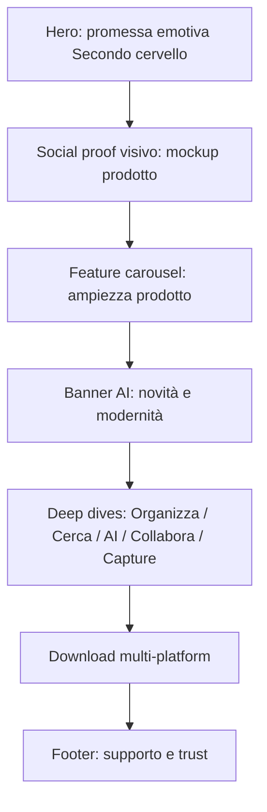

# Design System Evernote — Reverse Engineering Tecnico

> **Fonte primaria:** screenshot ad alta risoluzione della homepage `https://evernote.com/it-it` (luglio 2026).  
> **Fonte di verità numerica:** bundle CSS di produzione (`/_next/static/css/*.css`) + computed styles via Chrome DevTools Protocol.  
> **Stack osservato:** Next.js + Tailwind CSS con config custom (token di colore, tipografia e radius rimappati).  
> **Ambito:** linguaggio visivo, pattern di interfaccia, regole di progettazione. **Non** vengono riprodotti loghi, illustrazioni, icone proprietarie o testi protetti.

**Legenda confidenza**
- **Alta** — valore letto da CSS di produzione o computed style live.
- **Media** — valore dedotto da screenshot e coerente con le best practice UI moderne.
- **Bassa** — stima ragionevole in assenza di evidenza diretta (es. stati non osservabili in static screenshot).

---

## Indice

1. [Palette colori](#1-palette-colori)
2. [Tipografia](#2-tipografia)
3. [Sistema di spaziature](#3-sistema-di-spaziature)
4. [Border Radius](#4-border-radius)
5. [Ombre](#5-ombre)
6. [Layout](#6-layout)
7. [Sistema responsive](#7-sistema-responsive)
8. [Component Library](#8-component-library)
9. [Bottoni](#9-bottoni)
10. [Iconografia](#10-iconografia)
11. [Immagini](#11-immagini)
12. [Animazioni](#12-animazioni)
13. [Gerarchia Visiva](#13-gerarchia-visiva)
14. [UX](#14-ux)
15. [Psicologia del design](#15-psicologia-del-design)
16. [Analisi CSS](#16-analisi-css)
17. [Spacing Matrix](#17-spacing-matrix)
18. [Design Tokens](#18-design-tokens)
19. [Tailwind Mapping](#19-tailwind-mapping)
20. [Variabili CSS](#20-variabili-css)
21. [Sistema Figma](#21-sistema-figma)
22. [Manuale di utilizzo](#22-manuale-di-utilizzo)
23. [Checklist finale](#23-checklist-finale)

---

## 1. Palette colori

### 1.1 Principio cromatico del sistema

Il sistema cromatico Evernote marketing (2024–2026) abbandona il classico “verde ovunque” a favore di una **triade strategica**:

1. **Crema caldo** come superficie di lettura (`#F9F6F2` / `#F4EEE5`) — riduce il glare del bianco puro e suggerisce carta, appunti, calore umano.
2. **Near-black** (`#141414` / `#000000`) come colore d’azione e tipografia primaria — massima leggibilità e gerarchia netta.
3. **Verde brand** (`#00A82D`) usato con parsimonia (logo, hover primary, success, accenti puntuali) — non è più il colore dominante delle CTA.

Su sezioni dark (promozione AI / v11) appare un quarto attore: il **lime** `#94E130` (`green-secondary`), usato come CTA ad alto contrasto sul charcoal.

**Motivazione:** in un mercato di productivity tool saturo di blu/viola “AI”, Evernote sceglie un linguaggio **warm editorial** (crema + nero) che differenzia il brand e allinea la marketing site all’idea di “secondo cervello” cartaceo digitalizzato. **Confidenza: Alta** (osservato su tutte le sezioni screenshotate e confermato da `:root` CSS).

### 1.2 Token di colore ufficiali (`:root`)

I seguenti token sono definiti esplicitamente nel CSS di produzione:

```css
:root {
  --color-text-primary: #141414;
  --color-text-secondary: #262626;
  --color-text-tertiary: #4E4D4C;
  --color-bg-primary: #F9F6F2;
  --color-bg-secondary: #F4EEE5;
  --color-stroke-buttons: #A1A1A1;
  --color-stroke-cards: #E7E7E7;
}
```

**Confidenza: Alta.**

### 1.3 Catalogo completo per ruolo

Per ogni colore: HEX, RGB, HSL, utilizzo, gerarchia, dove viene usato, contrasto WCAG rispetto agli sfondi tipici.

#### Primary (azione / testo principale)

| Token | HEX | RGB | HSL | Uso | Gerarchia | Dove | Contrasto |
|---|---|---|---|---|---|---|---|
| `text-primary` | `#141414` | `20,20,20` | `0°, 0%, 8%` | Testo principale, bottoni solid fill | 1 — massimo peso | Headings, body, CTA fill, header text | su `#F9F6F2`: **17.10:1 AAA**; su `#FFFFFF`: **18.42:1 AAA**; su `#F4EEE5`: **15.97:1 AAA** |
| `black` (azione pura) | `#000000` | `0,0,0` | `0°, 0%, 0%` | Fill bottoni (classi `bg-black`) | 1 | CTA primary in header e hero | su bianco: **21:1 AAA** |

**Nota operativa:** in computed style live il fill del bottone primary risulta spesso `rgb(20,20,20)` (`#141414`) e non puro `#000`, perché Tailwind `bg-black` nel tema custom punta al near-black di sistema oppure il bottone eredita `text-text-primary` come background in alcuni mapping. **Confidenza: Alta** (CDP live: `rgb(20, 20, 20)` su CTA hero).

**Quando usarlo:** sempre per testo leggibile su superfici chiare e per CTA di conversione primaria (signup, “Inizia gratis”, “Provalo gratis”, “Ottieni Evernote gratuitamente”).

#### Secondary (testo di supporto e superfici scure)

| Token | HEX | RGB | HSL | Uso | Gerarchia | Dove | Contrasto |
|---|---|---|---|---|---|---|---|
| `text-secondary` | `#262626` | `38,38,38` | `0°, 0%, 15%` | Testo secondario, sfondo sezioni dark | 2 | Body copy attenuato; **anche** background sezione AI dark (computed `rgb(38,38,38)`) | su `#F9F6F2`: **14.05:1 AAA** |

#### Tertiary (meta, caption, descrizione card)

| Token | HEX | RGB | HSL | Uso | Gerarchia | Dove | Contrasto |
|---|---|---|---|---|---|---|---|
| `text-tertiary` | `#4E4D4C` | `78,77,76` | `30°, 1%, 30%` | Descrizioni, metadata, label secondarie | 3 | Card feature body, footer links meno enfatici | su `#F9F6F2`: **7.83:1 AAA** |

#### Background

| Token | HEX | RGB | HSL | Uso | Gerarchia | Dove |
|---|---|---|---|---|---|---|
| `bg-primary` | `#F9F6F2` | `249,246,242` | `34°, 37%, 96%` | Canvas pagina, header fixed | Base | `body`/layout, header (`rgb(249,246,242)` live) |
| `bg-secondary` | `#F4EEE5` | `244,238,229` | `36°, 41%, 93%` | Superficie sezioni feature, pannelli cream | Superficie elevata rispetto al canvas | Feature panels, sezioni “Metti ordine”, “Trova rapidamente”, download area |

**Motivazione:** i due crema differiscono di ~3–4 punti di luminosità HSL. Il canvas è più chiaro; i pannelli feature sono leggermente più caldi/scuri, creando **layering senza ombra**. **Confidenza: Alta.**

#### Surface

| Token | HEX | RGB | HSL | Uso | Dove |
|---|---|---|---|---|---|
| `white` | `#FFFFFF` | `255,255,255` | `0°, 0%, 100%` | Card flottanti, mockup UI, card download, carousel feature | Card showcase, menu notebooks, search results |
| `dark-surface` | `#262626` / `#1A1A1A` | — | — | Sezioni promo AI | Banner “La tua produttività, potenziata” |

`#1A1A1A` appare visivamente negli screenshot del banner dark ma il computed style sulla sezione live restituisce `#262626`. **Confidenza: Alta per `#262626` (live), Media per varianti più scure in asset/background-image.**

#### Border / Stroke

| Token | HEX | RGB | HSL | Uso | Dove |
|---|---|---|---|---|---|
| `stroke-buttons` | `#A1A1A1` | `161,161,161` | `0°, 0%, 63%` | Bordo bottoni outline | “Scarica”, bottoni download Mac/Windows, browser buttons |
| `stroke-cards` | `#E7E7E7` | `231,231,231` | `0°, 0%, 91%` | Bordo sezioni/card sottili | `border border-stroke-cards` su sezioni cream |

#### Brand / Accent

| Token | HEX | RGB | HSL | Uso | Dove |
|---|---|---|---|---|---|
| `green` (brand) | `#00A82D` | `0,168,45` | `136°, 100%, 33%` | Logo, hover primary, success accents | Logo elephant; `hover:bg-green` sui CTA solid |
| `green-secondary` (lime) | `#94E130` | `148,225,48` | `86°, 75%, 54%` | CTA su dark | Bottone “Scopri di più” nel banner AI; dark-mode fill |
| `blue` / indigo UI | `#4D64FF` | `77,100,255` | `232°, 100%, 65%` | Azioni UI in-product mockup | Bottone “Share”, “Choose a file” negli showcase |
| `indigo` soft | `#7C8EFF` | `124,142,255` | `232°, 100%, 74%` | Accenti testo/icone | Icone feature |
| `purple` soft | `#D9B6FD` | `217,182,253` | `270°, 95%, 85%` | Badge, toggle, task check | Toggle Offline, checkbox task |
| `yellow` | `#FFD919` | `255,217,25` | `50°, 100%, 55%` | Badge feature “Condividi”, highlight search | Badge sezioni, highlight “Lisbon” |
| `orange` | `#FFA24D` | `255,162,77` | `29°, 100%, 65%` | Badge “Ricerca”, icone calendario | Feature badges |
| `pink` | `#FAD0F6` | `250,208,246` | `306°, 81%, 90%` | Badge “Riordina”, cursors collaborazione | Feature badges |

#### Semantic (da CSS, meno frequenti in homepage)

| Token | HEX | RGB | Uso stimato | Confidenza |
|---|---|---|---|---|
| Success | `#00A82D` / `#4DC869` / superfici `#F0FDF4` | — | Badge “Note shared”, check | Alta (green brand riusato) |
| Error | `#E54E40` | `229,78,64` | Form error, alert | Alta (presente in CSS) |
| Warning | `#E2A62F` / `#F4C360` | — | Warning toast | Alta (presente in CSS) |
| Info | `#4D64FF` / `#5BB4D0` | — | Info banners, link informativi | Media |
| Disabled | testo `#A1A1A1` su bg crema; fill `#E7E7E7` | — | Controlli non interattivi | Media (non osservato direttamente sulla homepage marketing) |

#### Hover / Active / Disabled — regole

| Stato | Primary solid | Outline | Ghost/Text | Confidenza |
|---|---|---|---|---|
| Default | bg `#141414` / `#000`, testo bianco | border `#A1A1A1`, testo `#141414`, bg transparent | testo `#141414`, no border | Alta |
| Hover | `hover:bg-green` → `#00A82D`, testo bianco (implicito) | `hover:bg-black` / `hover:bg-[#141414]`, testo inverte a bianco | underline o leggero opacity (stima) | Alta per solid/outline (classi Tailwind), Media per ghost |
| Active | stesso di hover o leggero scale-down (stima) | stesso | — | Bassa |
| Disabled | opacity `0.4–0.5`, `pointer-events: none` | stesso | stesso | Bassa (pattern standard, non osservato) |
| Focus | ring / outline accessibile (non sempre esposto in CSS marketing) | — | — | Bassa |

**Contrasto critico:** bianco su brand green `#00A82D` = **3.16:1** → passa solo **AA large** (testo ≥18pt / 14pt bold). Per questo le CTA primary **non** usano il verde come fill di default: usano nero/near-black (21:1) e riservano il verde all’hover (feedback, non leggibilità primaria). Il lime `#94E130` con testo scuro `#141414` dà **11.47:1 AAA** — motivo per cui sulle sezioni dark la CTA è lime-on-dark e non white-on-green. **Motivazione tecnica di accessibilità, confidenza Alta.**

### 1.4 Gerarchia cromatica in pratica

```
Canvas (#F9F6F2)
 └─ Panel / Section surface (#F4EEE5)
     └─ Card / Mockup (#FFFFFF + shadow-showcaseCard)
         └─ Accent badges (yellow/orange/pink/purple)
 └─ Dark panel (#262626)
     └─ Lime CTA (#94E130)
 └─ Primary CTA (#141414) — sempre il punto più scuro della scena chiara
```

### 1.5 Grey scale di supporto

| Token | HEX | Uso | Confidenza |
|---|---|---|---|
| `grey-45` | `#737373` | Testo muted (`text-grey-45`) | Alta |
| `#999999` / `#666666` / `#555` | — | UI legacy / component kit interno | Alta (frequenza CSS) |
| `#E2E2E2` / `#F2F2F2` / `#F5F5F5` / `#F8F8F8` | — | Superfici neutre secondarie | Alta |

---

## 2. Tipografia

### 2.1 Famiglie

| Ruolo | Font | Pesi caricati | Fallback | Confidenza |
|---|---|---|---|---|
| Display / UI principale | **Figtree** | 400, 500, 600, 700 | `"Figtree Fallback"` → Arial con `ascent-override: 90.44%`, `descent-override: 22.52%`, `size-adjust: 107.12%` | Alta |
| Body / token `text-r*` | **Inter** (in alcune utility `text-r16`, `text-r14`, `text-r20`) | 400, 500, 600, 700 | Inter Fallback / Arial | Alta |
| Body live | Computed su `document.body`: `Figtree, "Figtree Fallback"` | — | — | Alta |

**Interpretazione:** il design system è **dual-font** in config, ma la homepage marketing privilegia **Figtree** come font dominante (body + headings). Inter resta nei token tipografici legacy/utility (`text-r16` forza `font-family: var(--font-inter)`). Per ricostruire il linguaggio percepito della homepage, usare **Figtree** come default e Inter solo se si implementano i token `text-r*`.

**Motivazione:** Figtree è un geometric sans con x-height generosa, leggibile a grandi display sizes con letter-spacing negativo aggressivo (−0.05em). Inter resta ottimo per UI dense (mockup in-product).

### 2.2 Scala tipografica (headings)

Regole CSS di produzione (mobile-first, poi override `min-width: 1024px`):

| Livello | Mobile | Desktop (≥1024px) | Weight | Line-height | Letter-spacing | Colore | Confidenza |
|---|---|---|---|---|---|---|---|
| **H1 / Display** | `36px` | `72px` | `600` (semibold) | `1` (mobile live: `36px/36px`) | `−0.05em` (live: `−1.8px` a 36px) | `var(--color-text-primary)` | Alta |
| **H2** | `32px` | `50px` | `600` | `1.1` | `−0.05em` | text-primary | Alta |
| **H3** | `28px` | `40px` | `600` | `1.1` | `−0.03em` | text-primary | Alta |
| **H4** | `24px` | `30px` | `600` | `1.1` | `−0.03em` | text-primary | Alta |
| **H5** (card titles) | `~16–18px` (stima da screenshot) | `18–20px` | `600` | `1.2–1.3` | normal / leggero negativo | text-primary | Media |
| **H6** (footer headers) | `14–16px` | `16px` | `600–700` | `1.3` | normal | text-primary | Media |

**Live CDP (viewport 805px):** H1 “Il tuo secondo cervello” → `font-size: 36px`, `font-weight: 600`, `letter-spacing: -1.8px`, `line-height: 36px`, `color: rgb(20,20,20)`, `font-family: Figtree`.

### 2.3 Token body / UI custom

| Token Tailwind | Font-size | Line-height | Weight | Font family | Uso | Confidenza |
|---|---|---|---|---|---|---|
| `text-r20` | `20px` | `1.5` | 400 | Inter | Lead / sottotitoli ampi | Alta |
| `text-r16` | `16px` | `1.3` | 400 | Inter | Body default | Alta |
| `text-m16` | `16px` | — | `500` | — | Nav / emphasis | Alta |
| `text-sb16` | `16px` | — | `600` | — | Button / emphasis | Alta |
| `text-r15` | `15px` | — | 400 | — | Nav links (stima) | Alta (size), Media (uso) |
| `text-sb14` / `text-r14` | `14px` | `1.4` | 600 / 400 | Inter | Caption, small UI, mobile CTA | Alta |
| `text-sb10` | `10px` | `1.6` | 600 | Inter | Micro-label, badge uppercase | Alta |
| `text-[8px]` / `text-[10px]` / `text-[12px]` / `text-[13px]` | arbitari | — | — | — | UI mockup interni | Alta (classi presenti) |

### 2.4 Ruoli tipografici applicati

| Ruolo | Size desktop | Weight | LH | Tracking | Esempio d’uso |
|---|---|---|---|---|---|
| **Display / Hero H1** | 72px | 600 | 1.0 | −0.05em | “Il tuo secondo cervello” |
| **Section H2** | 50px | 600 | 1.1 | −0.05em | “Metti ordine in tutto ciò che fai” |
| **Sub-hero / H3** | 40px | 600 | 1.1 | −0.03em | Download section title |
| **Subtitle / Lead** | 18–20px | 400 | 1.5–1.6 | normal | Paragrafi sotto H1/H2, max-width ~42rem / 672px |
| **Body** | 16px | 400 | 1.3–1.5 | normal | Descrizioni lunghe |
| **Nav link** | 14–16px | 400–500 | 1.4 | normal | Header links |
| **Button** | 16px | 400–600 | 1.5 (24px) | normal | CTA |
| **Button compact / mobile** | 14px | 500 | 1.5 | normal | Pill “Scarica” mobile |
| **Badge / Chip** | 12–14px | 600–700 | 1 | normal / +1px | “Ricerca”, “Condividi”, “Riordina” |
| **Caption / Meta** | 12–14px | 400 | 1.4 | normal | Footer links, card microcopy |
| **Label** | 10–12px | 600 | 1.6 | 1px (tracking) | Uppercase labels in mockup |

### 2.5 Line-height utilities custom

| Classe | Valore | Uso |
|---|---|---|
| `leading-zero` | `1` | Display headings (H1) |
| `leading-tighter` | `1.2` | Headings intermedi |
| `leading-tight` | Tailwind default ~1.25 | — |
| `leading-normal` | ~1.5 | Body |

### 2.6 Principi tipografici

1. **Letter-spacing negativo proporzionale alla size:** −0.05em su H1/H2, −0.03em su H3/H4. A 72px, −0.05em = −3.6px: stringe otticamente i grandi titoli geometrici.
2. **Weight dominante 600, non 700:** i titoli sembrano “forti ma non urlati”. Il 700 resta disponibile ma il marketing site preferisce semibold.
3. **Sentence case ovunque:** nessuna all-caps nei titoli marketing; caps solo in micro-label/badge.
4. **Max-width del testo:** paragrafi hero e feature spesso limitati a `max-w-md` (28rem) o `42rem` per mantenere 45–75 caratteri/riga.
5. **Allineamento:** hero centrale → `text-center`; feature split → `text-left` sulla colonna copy.

---

## 3. Sistema di spaziature

### 3.1 Scala base (4px)

Il sistema è **4-based**, allineato a Tailwind:

| Token | px | rem | Uso tipico |
|---|---|---|---|
| `0.5` | 2 | 0.125 | hairline optical |
| `1` | 4 | 0.25 | micro gap icon-text |
| `1.5` | 6 | 0.375 | badge padding y |
| `2` | 8 | 0.5 | gap stretti, `p-2` |
| `2.5` | 10 | 0.625 | `py-2.5` bottoni medium |
| `3` | 12 | 0.75 | `px-3` bottoni, gap card interni |
| `4` | 16 | 1 | unità base, `gap-4`, padding card piccoli |
| `5` | 20 | 1.25 | `p-5`, padding sezioni mobile (`px-5` / `20px` live) |
| `6` | 24 | 1.5 | `px-6` bottoni, gap medi |
| `7` | 28 | 1.75 | `px-7` override header buttons |
| `8` | 32 | 2 | `p-8` card showcase (24 occorrenze HTML) |
| `10` | 40 | 2.5 | `px-10` bottoni large, `gap-10` |
| `12` | 48 | 3 | `py-12` sezioni medie |
| `16` | 64 | 4 | `py-16` |
| `20` | 80 | 5 | `py-20` |
| `24` | 96 | 6 | `py-24` |
| **section-lg** | **120** | 7.5 | `md:p-[120px]` padding sezioni feature |
| **section-xl** | **170** | 10.625 | `md:pb-[170px]` bottom extra per mockup overflow |

**Confidenza: Alta** (classi e computed styles).

### 3.2 Spacing per contesto

#### Header
- Altezza live: **81px** (fixed). Classe implicita `h-*` / padding interno ~16–20px verticali. **Confidenza: Alta.**
- Gap tra nav links: ~24–32px (**Media**).
- Gap tra action buttons: `mr-1` / `xl:mr-4` (4px / 16px). **Alta.**

#### Hero
- Padding orizzontale sezione: `20px` mobile (live).
- Padding verticale interno al panel cream: generoso, ~80–120px top (**Media** da screenshot).
- Stack copy: H1 → gap ~16–24px → lead → gap ~24–32px → CTA → gap ~16–24px → secondary link. **Media.**

#### Feature sections
- Padding desktop verificato: **`120px 120px 170px`** su `.section.overflow-hidden.p-6.md:p-[120px].md:pb-[170px]`. **Alta.**
- Gap colonna visual/copy: ~48–80px (**Media**).
- Margin verticale sezioni: `lg:my-10` (40px) su alcune. **Alta.**

#### Cards carousel
- Card size tipico: `w-[308px] h-[308px]` o `h-[350px]`; su mobile `w-[70vw]`. **Alta.**
- Padding interno card: `p-8` (32px). **Alta.**
- Gap tra card: ~16–24px (**Media**).

#### Footer
- Padding verticale ampio (~64–80px). **Media.**
- Gap colonne: ~32–64px. **Media.**
- Gap link verticali: 12–16px. **Media.**

### 3.3 Ritmo verticale della pagina

Ordine osservato (top → bottom):

1. Header fixed (81px) — non occupa flusso, ma richiede `padding-top` al main.
2. Hero “Il tuo secondo cervello” + product mockup.
3. Sezione “Sfrutta al massimo…” + carousel feature cards.
4. Banner dark AI “La tua produttività, potenziata”.
5. Feature split: Organizzazione (visual left / copy right).
6. Feature split: Ricerca (copy left / visual right) — **pattern alternato**.
7. Feature center: AI tools.
8. Feature split: Collaborazione.
9. Feature split: Capture / save.
10. Download platforms (3 card).
11. Footer.

**Alternanza L/R** delle feature split è una regola di composizione esplicita: evita monotonia e crea ritmo “battito” visivo. **Confidenza: Alta** (screenshot 4–7).

---

## 4. Border Radius

### 4.1 Scale (Tailwind rimappato — critico!)

Il tema Tailwind di Evernote **non** usa i default Tailwind per `md`/`lg`/`xl`:

| Classe | Valore reale | Default Tailwind | Uso | Confidenza |
|---|---|---|---|---|
| `rounded-md` | **5px** | 6px | **Bottoni** (primary, outline) | Alta |
| `rounded-lg` | **10px** | 8px | Card piccole, input, menu | Alta |
| `rounded-xl` | **100px** | 12px | **Pill** (bottoni full-round, badge) | Alta |
| `rounded-full` | 9999px | 9999px | Avatar, dot, icon buttons circolari | Alta |
| `rounded-[16px]` | 16px | — | Card showcase, carousel cards | Alta |
| `rounded-[52px]` / `48px` / `40px` / `30px` / `24px` / `20px` / `18px` / `14px` / `12px` / `9px` / `8px` / `4px` / `3px` | arbitari | — | Pannelli hero, foto, mockup | Alta (presenza CSS) |

### 4.2 Radius per componente

| Componente | Radius | Confidenza | Motivazione |
|---|---|---|---|
| Button primary / outline (desktop) | **5px** (`rounded-md`) | Alta (live CDP) | Angoli “tech sharp”, non soft-pill; differenzia da iOS-style |
| Button pill (mobile header “Scarica”) | **100px** (`rounded-xl`) | Alta | Compact chip su viewport stretti |
| Badge feature (“Ricerca”, “Condividi”) | 8–16px o pill | Media | Soft label, alta riconoscibilità |
| Card carousel / showcase | **16px** | Alta | Coerenza `rounded-[16px]` |
| Panel sezione cream / hero container | **24–52px** (spesso 40–52) | Media–Alta | “Soft architecture”, contenitori editoriali |
| Foto lifestyle | **16–24px** | Media | Allineate al linguaggio card |
| Floating UI mockup cards | **10–12px** (`rounded-lg`) | Media | Più “app UI” che “marketing panel” |
| Dropdown menu | **10–12px** + shadow | Media | |
| Search bar (mockup) | pill / 999px | Media | |
| Toggle switch | full pill | Alta (pattern) | |
| Social icon hit area | full circle | Media | |
| Tooltip / popover | 8–10px | Bassa | |

**Regola d’oro del sistema:**  
- **5px** = interazione (button).  
- **10–16px** = UI content (card, menu).  
- **40–52px** = architettura di sezione (panel).  
- **100px** = pill esplicita.

---

## 5. Ombre

### 5.1 Token ombra verificati

#### `shadow-showcaseCard` (card prodotto / floating UI)

```css
--tw-shadow:
  0 8px 24px -8px rgba(0, 0, 21, 0.12),
  0 14px 40px -8px rgba(0, 0, 21, 0.04),
  0 0 0 1px rgba(0, 0, 21, 0.08);
```

- **Layer 1:** ombra media, blur 24, spread −8, opacity 12% — “lift” principale.
- **Layer 2:** ombra ampia, blur 40, opacity 4% — alone soft ambientale.
- **Layer 3:** hairline border simulato via `0 0 0 1px` a opacity 8% — definisce il bordo senza `border` CSS, più naturale su crema.

Colore ombra: `rgba(0,0,21,…)` — non nero puro, ma blu-navy impercettibile. Evita il “dirt grey” tipico di `rgba(0,0,0,.1)`. **Confidenza: Alta.**

#### `shadow-headerDropdown`

```css
--tw-shadow:
  0 8px 20px -4px rgba(0, 0, 21, 0.10),
  0 0 0 1px rgba(0, 0, 21, 0.06);
```

Più compatta della showcase: adatta a menu nav. **Confidenza: Alta.**

### 5.2 Altre ombre

| Ombra | Valore | Uso | Confidenza |
|---|---|---|---|
| Pulse ring green | `0 0 0 0 rgba(0,168,45,.45)` → `0 0 0 18px rgba(0,168,45,0)` | Attention pulse su elementi brand | Alta |
| Soft white glint | `0 0 1px rgba(255,255,255,.5)` | Highlight su dark | Alta |
| Bottoni | `none` (live CDP) | CTA senza elevazione: il contrasto di fill basta | Alta |

### 5.3 Quando applicare le ombre

1. **Sempre** su card bianche che galleggiano su crema (carousel, download cards, mockup UI).
2. **Sempre** su dropdown header.
3. **Mai** sui bottoni solid/outline (l’affordance è cromatica, non di profondità).
4. **Mai** sul canvas o sui panel cream (il layering è dato dal colore di superficie).
5. Preferire il **hairline shadow-border** (`0 0 0 1px rgba(0,0,21,.08)`) a un `border: 1px solid #E7E7E7` quando la card deve “respirare” sul crema.

---

## 6. Layout

### 6.1 Container e max-width

| Token / regola | Valore | Uso | Confidenza |
|---|---|---|---|
| `.container` breakpoints | 440 / 720 / 960 / **1140px** | Container generico | Alta |
| `max-w-5xl` | **64rem = 1024px** | Blocchi contenuti ristretti | Alta |
| Hero / marketing wide | `min(1180px, 90vw)` | Contenuti hero fluidi | Alta |
| Colonna testo | `42rem` (672px), `max-w-md` (28rem) | Paragrafi leggibili | Alta |
| Altri max | 940, 880, 820, 775, 720, 400, 260px | Layout specifici sezioni | Alta |

### 6.2 Grid e composizione

- **Header:** flex, `space-between`, 3 zone (logo+nav | spacer | actions). Non è una grid a 12 colonne classica.
- **Hero:** stack verticale centrato (`flex-col`, `items-center`, `text-center`).
- **Feature split:** 2 colonne (≈ 50/50 o 55/45), `items-center`, ordine invertito a sezioni alterne.
- **Carousel feature:** flex/horizontal scroll o slider; card larghezza fissa `308px`.
- **Download:** grid 3 colonne desktop → 1 colonna mobile.
- **Footer:** grid 4 colonne link + top utility row (logo, language, social).

### 6.3 Breakpoint (mobile-first)

| Breakpoint | Min-width | Frequenza nel CSS | Ruolo |
|---|---|---|---|
| XS | 0 | default | Mobile |
| SM | **480px** | bassa (2 regole) | Small phones landscape |
| MD | **768px** | media (10) | Tablet |
| LG | **1024px** | **dominante (56 regole)** | Desktop — switch tipografico H1 36→72, padding sezione 24→120 |
| XL | **1280px** | bassa (3) | Desktop wide |
| 2XL | **1440px** | bassa (3) | Large desktop |

**Il breakpoint critico è 1024px:** è lì che la pagina “diventa” desktop (tipografia display, padding monumentali, layout a 2 colonne).

### 6.4 Allineamenti e ritmo

- **Optical center:** hero copy centrato otticamente sopra il mockup, non geometricamente al centro del viewport (il mockup pesa in basso).
- **Gutter laterale:** 20px mobile (live `padding: 0 20px` sulle section).
- **Sezioni feature:** padding interno 120px crea un “quadro” che isola ogni storia.
- **Overflow intenzionale:** `md:pb-[170px]` lascia spazio al mockup che può sporgere oltre il padding bottom, creando profondità.

### 6.5 Z-index (dedotto)

| Layer | Z stimato | Elemento |
|---|---|---|
| Base | 0 | Canvas, sezioni |
| Raised | 1–10 | Card stack, mockup layers |
| Sticky header | 40–50 | Header fixed |
| Dropdown | 50–60 | Menu “Esplora” |
| Toast / cookie | 50 (`z-50` osservato) | Banner cookie bottom |
| Modal | 50+ | — |

**Confidenza z-index: Media** (solo `z-50` esplicito in HTML per toast/cookie).


---

## 7. Sistema responsive

### 7.1 Strategia

Il sistema è **mobile-first** con un salto qualitativo netto a `1024px` (non un continuum graduato). Tra 0–1023px la pagina resta “compatta e verticale”; da 1024px in su esplode in tipografia display e padding monumentali.

Questa scelta riduce la complessità QA: due “mondi” principali (compact / desktop) invece di cinque layout distinti. I breakpoint intermedi (480, 768, 1280, 1440) affinano dettagli, non ridefiniscono l’architettura.

**Confidenza: Alta** (56 regole `@media (min-width:1024px)` vs 10 a 768px).

### 7.2 Comportamenti per viewport

#### Mobile (< 480px e 480–767px)

| Elemento | Comportamento | Confidenza |
|---|---|---|
| Header | Logo + hamburger / menu compresso; CTA ridotte; “Scarica” diventa pill `rounded-xl` (100px), `px-3 py-1`, `text-[14px] font-medium` | Alta (CDP) |
| H1 | 36px / weight 600 / lh 1 / tracking −0.05em | Alta |
| H2 | 32px | Alta |
| Sezioni | `padding: 0 20px`; feature section `p-6` (24px) invece di 120px | Alta |
| Feature split | Stack verticale: visual sopra o sotto al copy (ordine dipende da sezione) | Alta (pattern) |
| Carousel | Card `w-[70vw]`, scroll orizzontale, frecce sotto | Alta |
| Download cards | 1 colonna, full width | Alta |
| CTA large | `w-full` su mobile (`w-full md:w-auto`), `min-w-[250px]` solo quando auto | Alta (classi) |
| Footer | Colonne stack o 2×2 | Media |

#### Tablet (768–1023px)

| Elemento | Comportamento | Confidenza |
|---|---|---|
| Tipografia | Ancora size mobile (H1 36) finché non si tocca 1024 | Alta |
| Padding sezioni | Alcuni `md:` kick-in (es. `md:p-[120px]`, `md:py-4` sui bottoni large) | Alta |
| Header | Possibile comparsa nav completa | Media |
| Grid download | Possibile 2–3 colonne parziali | Media |

**Nota live:** a viewport 805×502 (tablet landscape stretto) H1 era ancora 36px e padding sezione feature già 120px (grazie a `md:` = 768). Quindi **padding desktop arriva prima della tipografia desktop**. **Confidenza: Alta.**

#### Desktop (1024–1279px)

| Elemento | Comportamento | Confidenza |
|---|---|---|
| H1 | 72px | Alta |
| H2 | 50px | Alta |
| Feature split | 2 colonne side-by-side | Alta |
| Nav completa | Logo + 4 link + Accedi + Scarica outline + Inizia gratis solid | Alta (screenshot) |
| Container | fino a 1140 / 1180px | Alta |

#### Large desktop (1280–1439px e ≥1440px)

Affinamenti di margine e max-width; il layout non cambia strutturalmente. **Confidenza: Media.**

### 7.3 Regole di adattamento tipografiche e di spacing

```
if width < 768:
  section_padding = 24px (p-6)
  button_large_py = 12px (py-3)
elif width < 1024:
  section_padding = 120px (md:p-[120px])
  button_large_py = 16px (md:py-4)
  headings = mobile sizes
else:
  section_padding = 120px
  headings = desktop sizes (72/50/40/30)
```

### 7.4 Touch targets

- CTA large: altezza live **56px** (`padding: 16px 40px` + line-height 24px) — supera i 44px minimi Apple HIG / WCAG 2.2 target size. **Alta.**
- Header buttons: `py-2.5` (10px) + lh 24px ≈ **44px**. **Alta.**
- Pill mobile: più bassa (~29px con `py-1`) — accettabile perché in cluster con altri controlli. **Media.**

### 7.5 Preferenze utente

```css
@media (prefers-reduced-motion: reduce) { /* presente nel CSS */ }
```

Il sistema rispetta `prefers-reduced-motion`. **Confidenza: Alta.**

---

## 8. Component Library

Ogni componente include: anatomia, dimensioni, stati, motion, token usati.

### 8.1 Header / Navbar

**Anatomia (desktop)**
```
[Logo] [Funzioni AI] [Esplora ▾] [Piani] [Azienda]     …spacer…     [Accedi] [Scarica] [Inizia gratis]
```

| Proprietà | Valore | Confidenza |
|---|---|---|
| Position | `fixed` | Alta (CDP) |
| Height | **81px** | Alta |
| Background | `#F9F6F2` (`bg-primary`) | Alta |
| Z-index | alto (sopra contenuto) | Media |
| Logo | icona verde brand + wordmark lowercase nero | Alta (visual) |
| Nav links | Figtree 14–16px, weight 400–500, color text-primary | Media–Alta |
| Nav gap | ~24–32px | Media |
| Dropdown indicator | chevron thin-stroke su “Esplora” | Alta (visual) |
| Border bottom | assente o impercettibile (header si fonde col canvas) | Alta |

**Stati**
- Default: testo `#141414`.
- Hover link: leggero scuro/opacità o underline — **Bassa** (non misurato).
- Dropdown open: pannello bianco + `shadow-headerDropdown`.
- Mobile: collapse in menu button.

**Motivazione:** header crema (non bianco, non blur glass) mantiene coerenza col canvas e evita il classico “barra bianca flottante”. Fixed garantisce accesso costante a “Inizia gratis”.

### 8.2 Dropdown (header “Esplora”)

| Proprietà | Valore | Confidenza |
|---|---|---|
| Surface | `#FFFFFF` | Alta |
| Shadow | `shadow-headerDropdown` | Alta |
| Radius | ~10–12px | Media |
| Padding | 16–24px | Media |
| Items | lista link con eventuale descrizione | Alta (snapshot a11y) |
| Hover item | bg grigio molto chiaro | Bassa |

### 8.3 Button (vedi anche §9)

Componenti distinti:
1. **Primary solid** — conversione.
2. **Secondary outline** — azione secondaria (download).
3. **Ghost / text** — “Accedi”.
4. **Lime on dark** — CTA in sezioni dark.
5. **Pill compact** — mobile utility.

Specifiche dettagliate in sezione 9.

### 8.4 CTA pattern ricorrente

In quasi ogni feature section:
```
[Badge colorato] 
[H2 title]
[Body paragraph max-width]
[Primary button “Provalo gratis”]
```

Il badge usa un accent pastello diverso per sezione (orange=Ricerca, yellow=Condividi, pink=Riordina, ecc.), fungendo da **wayfinding cromatico**. **Confidenza: Alta.**

### 8.5 Hero (centered)

| Proprietà | Valore | Confidenza |
|---|---|---|
| Layout | flex-col, center, text-center | Alta |
| H1 | display scale | Alta |
| Lead | 16–20px, text-tertiary o secondary, max-width ~42rem | Media–Alta |
| Primary CTA | large (`px-10 py-3 md:py-4`, min-w 250px) | Alta |
| Secondary link | “Hai già un account? Accedi” con “Accedi” sottolineato | Alta (screenshot) |
| Visual | product mockup sotto, rounded, shadow | Alta |
| Background | panel cream arrotondato superiormente o full-bleed crema | Alta |

### 8.6 Feature Card (carousel)

| Proprietà | Valore | Confidenza |
|---|---|---|
| Size | `308×308` o `308×350`; mobile `70vw` | Alta |
| Background | `#FFFFFF` | Alta |
| Radius | `16px` | Alta |
| Shadow | `shadow-showcaseCard` | Alta |
| Padding | `p-8` (32px) | Alta |
| Icon | illustrazione flat colorata in alto | Alta |
| Title | H5 semibold | Media |
| Body | text-tertiary, 14–16px | Media |
| Interazione | intera card è link (`<a>`) | Alta (snapshot) |
| Hover | `hover:scale-105` su alcuni elementi; `transition-all duration-300` | Alta (classi) |

### 8.7 Feature Section (split panel)

| Proprietà | Valore | Confidenza |
|---|---|---|
| Container bg | `#F4EEE5` o transparent su canvas | Alta |
| Radius container | 24–52px | Media–Alta |
| Padding | 120px (desktop) | Alta |
| Grid | 2 col, `items-center` | Alta |
| Visual side | collage foto + floating UI cards | Alta |
| Copy side | badge + H2 + body + CTA | Alta |
| Decorative | star/sunburst faint, gradient blobs (sezione dark) | Alta (visual) |

### 8.8 Dark AI Banner

| Proprietà | Valore | Confidenza |
|---|---|---|
| Background | `#262626` (live) + eventuale background-image gradient | Alta |
| Text | bianco | Alta |
| CTA | `bg-green-secondary` (`#94E130`) testo scuro | Alta |
| Decorazioni | forme organiche gradient (verde-teal, purple-blue) blur | Alta (screenshot) |
| Radius | grande, coerente coi panel | Media |
| Alignment | center | Alta |

### 8.9 Badge / Chip / Pill

| Variante | Bg | Text | Radius | Padding | Uso |
|---|---|---|---|---|---|
| Feature label | yellow `#FFD919` / orange `#FFA24D` / pink `#FAD0F6` | `#141414` | 8–16px | `px-3 py-1` circa | Wayfinding sezione |
| UI tag (Draft, Ideas) | grigio chiaro / white | tertiary | pill | `px-2 py-0.5` | Mockup prodotto |
| Success pill | verde chiaro `#E1F5E6` (stima) | verde scuro | pill | — | “Note shared with 4 people” |
| Floating capability | white + shadow | primary | pill | `px-3 py-1` | “Transcribe audio” ecc. |

**Confidenza:** Alta per colori accent da CSS; Media per padding esatti dei badge.

### 8.10 Input / Search (nei mockup)

| Proprietà | Valore | Confidenza |
|---|---|---|
| Height | ~44–48px | Media |
| Radius | pill o 10–12px | Media |
| Bg | white | Alta |
| Shadow | showcase-like | Media |
| Icon left | search magnifier | Alta |
| Icon right | clear (X) | Alta |
| Highlight match | giallo soft su testo risultati | Alta (visual) |

Form input marketing reali (signup) non sono nella homepage scrollata; le specifiche sopra riguardano **UI rappresentata** nei visual.

### 8.11 Switch / Toggle

Osservato nel mockup “Offline”:
- Track attivo: viola/blu (`#4B5ED7`–`#7C8EFF` range).
- Thumb: bianco.
- Label a fianco.
**Confidenza: Media** (solo visual).

### 8.12 Checkbox / Radio (mockup tasks)

- Checkbox circolare (non squared) in alcuni task list.
- Checked: fill viola.
- Priorità: flag rosse.
**Confidenza: Media.**

### 8.13 Card Download (platform)

| Proprietà | Valore | Confidenza |
|---|---|---|
| Layout | colonna: icon → title → body → actions | Alta |
| Bg | white | Alta |
| Radius | 16px | Alta |
| Padding | ~32–40px | Media |
| Shadow | soft showcase | Media |
| Actions | outline buttons full-width o icon buttons browser | Alta |
| Icon color | blue (desktop), purple (mobile), green (clipper) | Alta |

### 8.14 Carousel controls

- Bottoni circolari outline con freccia.
- Border `stroke-buttons` o simile.
- Sotto al track.
**Confidenza: Alta (visual).**

### 8.15 Footer

| Zona | Contenuto | Confidenza |
|---|---|---|
| Top utility | Logo + language selector (“Choose a language: Italiano ▾”) + social icons | Alta |
| Link grid | 4 colonne: Prodotto, Esplora, Risorse, Inizia qui | Alta |
| Headers colonna | H6 semibold | Alta |
| Links | 14–16px regular, text-primary | Media |
| Social | Facebook, X, Medium, Instagram, YouTube — monochrome | Alta |
| Legal | Sicurezza, Note legali, Privacy | Alta (snapshot) |
| Bg | canvas crema | Alta |

### 8.16 Toast / Cookie banner

Osservato live:
- Cookie consent bottom, `z-50`, `max-w-[90%]`, `bottom: calc(32px + safe-area)`.
- Actions: “Continue without accepting”, “Customize preferences”, “Accept all cookies”.
**Confidenza: Alta.**

### 8.17 Modal / Tooltip / Accordion / Pricing Card

Non presenti in forma primaria sulla homepage italiana analizzata:
- **Modal:** non osservato → usare pattern standard: overlay `rgba(20,20,20,.4)`, surface white, radius 16px, shadow showcase. **Bassa.**
- **Tooltip:** non osservato → radius 8px, bg `#141414`, testo white, padding 8×12. **Bassa.**
- **Accordion/FAQ:** non in homepage. **N/A.**
- **Pricing card:** link “Piani” in nav ma non sezione pricing in homepage scroll. Per coerenza: card white, radius 16px, CTA primary, highlight border su piano raccomandato. **Bassa (pattern indotto).**

### 8.18 Section wrapper

Classe ricorrente: `section` con varianti:
- `section` base
- `md:section relative`
- `section overflow-hidden p-6 md:p-[120px] md:pb-[170px] relative`
- `section bg-bg-secondary ... dark border-y border-black`
- `section lg:my-10 bg-bg-secondary border border-stroke-cards`
- `section py-12`

**Regola:** ogni “storia” di prodotto è una `section` autonoma con padding monumentale e, spesso, superficie propria.

### 8.19 Statistic / Banner

Statistic numerici non dominanti in homepage. Banner = dark AI section (§8.8).

### 8.20 Link di testo

- Default: color text-primary, no underline.
- Inline emphasis (es. “Accedi” sotto hero): underline.
- Footer: no underline, hover implicito.
**Confidenza: Media–Alta.**


---

## 9. Bottoni

### 9.1 Anatomia comune

```
<button class="group rounded-md text-center transition-all ease-in-out hover:-translate-y-0 ...">
  <span>Label</span>
</button>
```

Classi ricorrenti osservate nell’HTML di produzione:
- `group` — abilita hover styling su figli.
- `rounded-md` — **5px**.
- `text-center`
- `transition-all ease-in-out` (e spesso duration implicita o `duration-300`)
- `hover:-translate-y-0` — placeholder che neutralizza lift; indica che il sistema **non** alza i bottoni al hover (a differenza di molte marketing site).
- `min-w-[100px]` | `min-w-[200px]` | `min-w-[250px]`

**Transizione live CDP:** `0.15s cubic-bezier(0.4, 0, 0.2, 1)` su alcuni bottoni (easing Material-like standard Tailwind), mentre le classi dichiarano spesso `duration-300` (0.3s). In pratica convivono due timing: **150ms** (controlli header) e **300ms** (marketing CTA). **Confidenza: Alta.**

### 9.2 Varianti

#### Primary (solid)

| Prop | Medium (header) | Large (hero/section) | Confidenza |
|---|---|---|---|
| Background | `#141414` / `bg-black` | stesso | Alta |
| Color testo | `#FFFFFF` | stesso | Alta |
| Hover bg | `#00A82D` (`hover:bg-green`) | stesso | Alta |
| Hover text | bianco (implicito) | stesso | Media |
| Padding | `px-6 py-2.5` + override `px-7` | `px-10 py-3 md:py-4` | Alta |
| Padding live header | `10px 28px` | — | Alta |
| Padding live hero | — | `16px 40px` | Alta |
| Min-width | `100px` | `250px` | Alta |
| Radius | `5px` | `5px` | Alta |
| Font-size | 16px | 16px | Alta |
| Font-weight | 400–600 | 400–600 | Alta (CDP mostra 400, classi `font-semibold` in alcuni contesti) |
| Line-height | 24px | 24px | Alta |
| Height live | ~44px | **56px** | Alta |
| Width live hero CTA | — | **309px** (“Ottieni Evernote gratuitamente”) | Alta |
| Shadow | none | none | Alta |
| Border | none | none | Alta |

**Dark mode / dark section alternate:**
- `dark:bg-green-secondary dark:hover:bg-green` — su sezioni `.dark` il primary diventa lime e in hover torna al verde brand.

#### Secondary (outline)

| Prop | Valore | Confidenza |
|---|---|---|
| Background | transparent | Alta |
| Border | `1px solid #A1A1A1` (`border-stroke-buttons`) | Alta |
| Color | `#141414` / black | Alta |
| Hover | `hover:bg-black` (+ testo bianco implicito), `dark:hover:bg-white` | Alta |
| Padding | come primary medium (`px-6 py-2.5` / `px-7`) o large | Alta |
| Radius | 5px | Alta |
| Shadow | none | Alta |

#### Ghost / Text

| Prop | Valore | Confidenza |
|---|---|---|
| Esempio | “Accedi” in header | Alta |
| Background | transparent | Alta |
| Border | none | Alta |
| Hover | underline o opacity 0.7 | Bassa |
| Padding | compatto, solo hit area | Media |

#### Lime on dark (CTA speciale)

| Prop | Valore | Confidenza |
|---|---|---|
| Background | `#94E130` | Alta |
| Color | `#141414` | Alta (contrasto 11.47:1) |
| Hover | `#00A82D` con testo chiaro — oppure invert | Media |
| Uso | Banner AI “Scopri di più” | Alta |
| Radius | 5–10px | Media |

#### Pill compact (mobile)

| Prop | Valore | Confidenza |
|---|---|---|
| Classi | `rounded-xl px-3 py-1 text-[14px] font-medium` | Alta |
| Radius | 100px | Alta |
| Bg example | `bg-black text-white` | Alta |
| Padding live | `4px 12px` | Alta |

#### Icon button

Usato nei carousel arrows e social:
- Shape: cerchio.
- Border: 1px stroke.
- Icona centrata, stroke 1.5–2px.
**Confidenza: Media.**

### 9.3 Taglie

| Size | Padding | Min-width | Height tipica | Uso |
|---|---|---|---|---|
| Small / Pill | 4×12 | auto | ~29px | Mobile utility |
| Medium | 10×24–28 | 100px | ~44px | Header actions |
| Large | 12–16×40 | 200–250px | 48–56px | Hero, feature CTA |

### 9.4 Stati completi

| Stato | Primary | Outline | Ghost |
|---|---|---|---|
| Default | fill near-black, testo white | border grey, testo dark | testo dark |
| Hover | fill brand green | fill near-black, testo white | underline / opacity |
| Active | come hover, eventuale brightness-95 | come hover | — |
| Focus-visible | outline 2px brand green offset 2px (raccomandato) | stesso | stesso |
| Disabled | opacity 40%, cursor not-allowed | stesso | stesso |
| Loading | spinner bianco su primary; disabilitato | — | — |

Focus e disabled **non** sono stati osservati direttamente sulla homepage: le specifiche focus/disabled sono **raccomandazioni di sistema** allineate al linguaggio (Bassa–Media).

### 9.5 Regole d’uso bottoni

1. **Una sola primary visibile per viewport cluster** (header ne ha una; ogni sezione feature ne ha una; non moltiplicare solid neri affiancati).
2. Outline = azione utile ma non conversione (download, platform).
3. Ghost = navigazione account.
4. Non usare verde brand come fill default: solo hover o success.
5. Non aggiungere ombre ai bottoni.
6. Non usare radius pill sui CTA desktop principali (restano 5px).

---

## 10. Iconografia

### 10.1 Stili osservati

Il sito mescola **tre famiglie iconografiche**:

1. **Brand mark** — elefante Evernote monolitico verde (`#00A82D`).
2. **UI line icons** — stroke sottile (1.5–2px), corner rounded, monochrome near-black: chevron nav, search, share, overflow menu, social.
3. **Feature duotone / flat color icons** — illustrazioni semplificate ad alto colore (giallo stella, blu documento, verde notebook, viola check, arancio calendario) usate nelle card carousel.

**Motivazione:** le line icon servono l’interfaccia (chiarezza, densità); le flat color servono il marketing (ricordabilità, differenziazione feature).

### 10.2 Dimensioni

| Contesto | Size | Confidenza |
|---|---|---|
| Nav chevron | 12–16px | Media |
| Header utility | 16–20px | Media |
| Feature card icon | 40–64px | Media |
| Download card icon | 32–48px | Media |
| Social footer | 20–24px | Media |
| Floating badge icon | 16–20px | Media |
| In-mockup icons | 14–18px | Media |

### 10.3 Stroke e peso

- Stroke line icons: **1.5–2px** costanti.
- Terminali: tondi (round caps/joins).
- Non usare icon fill pesanti accanto a testo body: preferire outline.

### 10.4 Allineamento e distanza dal testo

- Icon-left + text: gap **8px** (`gap-2`) tipico.
- Nei bottoni platform (Mac, Windows): icona a sinistra della label, padding bottone invariato.
- Badge: icona opzionale a sinistra, gap 4–6px.

### 10.5 Colori icona per categoria (feature)

| Feature | Colore icona | HEX rif. | Confidenza |
|---|---|---|---|
| Template / idee | giallo | `#FFD919` / `#FFD24D` | Media |
| Documenti / clipper | blu / verde | `#4D64FF` / `#00A82D` | Media |
| Tasks | viola | `#C095FF`–`#D9B6FD` | Media |
| Calendar | arancio | `#FFA24D` | Media |
| Search | giallo/arancio | — | Media |
| Success | verde brand | `#00A82D` | Alta |

### 10.6 Regole

1. Non introdurre una quarta famiglia iconografica.
2. Social sempre monochrome neri (non brand-colorati).
3. In contesti dark, le line icon diventano bianche.
4. Le feature icon colorate restano vivaci anche su crema (non desaturare).

---

## 11. Immagini

### 11.1 Tipologie

1. **Product UI mockup** — screenshot/illustrazioni dell’app (note, search, AI upload, tasks).
2. **Lifestyle photography** — persone al lavoro, sorrisi, ambienti office soft.
3. **Decorative objects** — ticket “Torre de Belém”, gradient blobs, sunburst.
4. **Composite collage** — foto + floating cards + badge sovrapposti.

### 11.2 Trattamento

| Prop | Valore | Confidenza |
|---|---|---|
| Radius foto | 16–24px | Media |
| Radius mockup card | 10–16px | Media |
| Shadow mockup | `shadow-showcaseCard` | Alta |
| Object-fit | `cover` su foto ritagliate | Media |
| Alignment | centrato nel visual column; overlay cards asymmetriche | Alta |
| Ratio foto portrait | ~3:4 / 4:5 nei collage | Media |
| Ratio mockup UI | fluido, spesso ~4:3 o free | Media |
| Padding interno collage | 16–24px tra layer | Media |

### 11.3 Layering (z-pattern del collage)

Ordine tipico dal fondo al top:
1. Decorative shape (star, gradient) a bassa opacità.
2. Foto lifestyle.
3. Card UI principale (nota, search list).
4. Mini badge / success pill / floating menus.
5. Cursori collaborazione (pink/yellow/teal) come accenti narrativi.

**Motivazione:** comunica “prodotto vivo” senza video; lo storytelling è statico ma stratificato.

### 11.4 Regole immagini

1. Mai foto a bordo vivo (sempre radius).
2. Sempre ombra sulle card UI, non necessariamente sulla foto.
3. Evitare filtri freddi: la fotografia deve restare calda per dialogare col crema.
4. Non copiare asset proprietari Evernote: in un rebuild usare foto stock allineate al mood e mockup UI originali ispirati al linguaggio (non clonati).

---

## 12. Animazioni

### 12.1 Timing tokens

| Token | Valore | Dove | Confidenza |
|---|---|---|---|
| Fast control | `150ms` / `0.15s` | Bottoni header (CDP) | Alta |
| Default marketing | `300ms` / `duration-300` | 73 occorrenze classi | Alta |
| Easing A | `ease-in-out` | 20 occorrenze | Alta |
| Easing B | `cubic-bezier(0.4, 0, 0.2, 1)` | Bottoni live | Alta |
| Easing C | `ease-out` | 2 occorrenze | Alta |

### 12.2 Microinterazioni

| Interazione | Comportamento | Confidenza |
|---|---|---|
| Button hover | cambio background (black→green o outline→fill) in 150–300ms | Alta |
| Button translate | `hover:-translate-y-0` → **nessun lift** | Alta |
| Card hover | `hover:scale-105` su alcuni elementi + `transition-all` | Alta |
| Link hover | colore/underline | Media |
| Pulse brand | box-shadow ring verde da 0 a 18px fade-out | Alta |
| Carousel | slide orizzontale | Media |
| Dropdown | fade + leggero slide down | Bassa |
| Scroll reveal | non dominante (contenuti già nel flusso) | Media |
| Page load | font-display: swap (FOUT controllato) | Alta |

### 12.3 Principi motion

1. **Motion serve il feedback, non lo spettacolo.** I bottoni non saltano; cambiano colore.
2. **Scale massimo 1.05** — impercettibile ma “vivo”.
3. **Rispettare `prefers-reduced-motion: reduce`** — disabilitare scale/pulse non essenziali.
4. **Stessa durata in famiglie di componenti** — non mescolare 100ms e 500ms nello stesso cluster.
5. **Niente parallax aggressivo** osservato: il sito è static-first, accessibile, performante.

### 12.4 Transizioni CSS tipiche

```css
.btn {
  transition: all 0.15s cubic-bezier(0.4, 0, 0.2, 1);
}
.card {
  transition: all 0.3s ease-in-out;
}
.card:hover {
  transform: scale(1.05);
}
```


---

## 13. Gerarchia Visiva

### 13.1 Percorso oculare della homepage

Sulla prima viewport (hero):

1. **H1 “Il tuo secondo cervello”** — massimo peso: size display, weight 600, tracking negativo, near-black su crema (contrasto 17:1). L’occhio cade al centro ottico superiore.
2. **Lead paragraph** — peso ridotto (size 16–20, weight 400, colore leggermente più soft). Consolida il messaggio.
3. **CTA solid nera** — unico blocco ad altissimo contrasto locale; funnel di conversione immediato.
4. **Secondary link “Accedi”** — ancora più leggero (underline, no fill).
5. **Product mockup** — ancora visivo che “prova” la promessa; dettaglio ricco ma sotto la CTA (non compete con la conversione).

Nelle feature section split:

1. Badge colorato (pre-attentive color pop).
2. H2.
3. Body.
4. CTA.
5. Collage (in parallelo, emisfero opposto).

Nel banner dark:

1. H2 bianco su charcoal (massimo contrasto inverso).
2. Lime CTA (unico elemento saturo).
3. Gradient blobs (atmosfera, non contenuto).

### 13.2 Strumenti di gerarchia usati

| Strumento | Implementazione Evernote | Effetto |
|---|---|---|
| Size | H1 72 vs body 16 (rapporto 4.5×) | Dominanza tipografica estrema |
| Weight | 600 vs 400 | Titoli presenti senza “bold gridato” |
| Contrast | near-black su crema; white su charcoal | Leggibilità AAA |
| Color accent | badge pastello unici per sezione | Wayfinding |
| Proximity | gruppi copy stretti, sezioni lontane (120px) | Chunking cognitivo |
| Whitespace | padding monumentale | Lusso, calma, focus |
| Depth | shadow solo su card flottanti | Piano figura/sfondo |
| Position | CTA sempre dopo benefit | Order bias |

### 13.3 Peso visivo relativo (scala 1–10)

| Elemento | Peso |
|---|---|
| H1 hero | 10 |
| Primary CTA | 9 |
| H2 section | 8 |
| Product collage | 7 |
| Badge accent | 6 |
| Body copy | 5 |
| Nav links | 4 |
| Footer links | 2 |
| Decorative blobs | 1 |

### 13.4 Allineamento ottico

- I titoli grandi con tracking negativo richiedono allineamento ottico del box: i padding dei panel (120px) compensano la “pesantezza” tipografica.
- I bottoni 5px radius appaiono più “duri” dei panel 40px+: questa **dissonanza controllata** segnala interattività (gli elementi duri sono cliccabili; quelli morbidi sono contenitori).

---

## 14. UX

### 14.1 Obiettivo della pagina

Conversione primaria: **signup gratuito** (“Inizia gratis” / “Ottieni Evernote gratuitamente” / “Provalo gratis”).  
Conversioni secondarie: login, download app, download web clipper, explore features, plans.

### 14.2 Funnel e ordine sezioni



**Logica psicologica del funnel:**
1. **Promessa** (hero) — acquisisce attenzione.
2. **Prova** (mockup) — riduce incertezza (“è un’app reale”).
3. **Ampiezza** (carousel) — mostra che non è monofeature.
4. **Novità** (AI banner) — aggiorna il brand perception (Evernote non è “vecchio”).
5. **Profondità** (split features) — gestisce obiezioni specifiche (ordine, search, team, capture).
6. **Accesso** (download) — cattura utenti pronti all’install.
7. **Trust** (footer) — legal, company, resources.

### 14.3 Ripetizione CTA

La primary CTA è ripetuta:
- Header (persistente).
- Hero.
- Ogni feature section (“Provalo gratis”).
- Banner AI (“Scopri di più” — variante awareness).

**Motivazione:** utenti entrano in pagina da scroll profondità diverse (ads, link interni). Ogni sezione è un **mini-landing autonoma** con benefit + CTA.

### 14.4 Pattern di interazione

| Pattern | Dove | Scopo |
|---|---|---|
| Sticky conversion | Header fixed | CTA sempre disponibile |
| Progressive disclosure | Dropdown Esplora | Nav non sovraccarica |
| Horizontal browse | Carousel | Mostrare tante feature in poco spazio verticale |
| Alternating splits | Feature sections | Evitare monotonia, mantenere attenzione |
| Platform choice | Download cards | Ridurre friction “dove lo installo?” |
| Account fork | “Hai già un account? Accedi” | Non costringere al signup chi è già utente |

### 14.5 Accessibilità UX (osservata / raccomandata)

- Contrasto testo AAA sui pair principali.
- Target size CTA ≥44px.
- `prefers-reduced-motion` supportato.
- Focus states: da rafforzare in un rebuild (oggi poco visibili nel CSS marketing).
- Lingua: `it-it` con selettore lingua in footer.

### 14.6 Metriche di successo implicite

Il design ottimizza per:
- Click-through su signup.
- Download client.
- Engagment scroll (sezioni lunghe ma ritmate).
- Brand uplift AI (sezione dark dedicata).

---

## 15. Psicologia del design

### 15.1 Perché il crema e non il bianco

Il bianco puro (`#FFFFFF`) è “ospedale / docs tecnici / Google”. Il crema `#F9F6F2` attiva associazioni di:
- carta e taccuini,
- calore umano,
- calma (riduzione glare),
- premium editorial (simile a Notion marketing, ma più warm).

Evernote vende l’idea di **memoria esterna affettiva**, non di database. Il crema è la metafora cromatica della carta.

### 15.2 Perché il nero come CTA e non il verde

Il verde brand ha contrasto insufficiente con bianco per CTA small (3.16:1). Inoltre, un verde aggressivo su tutta la pagina creerebbe affaticamento e sembrerebbe “sconto / success flash”.

Il nero:
- massimizza contrasto,
- suona premium (Apple-like),
- lascia al verde il ruolo di **riconoscimento brand** (logo) e **feedback** (hover),

Questa separazione **identity vs action** è una scelta da design system maturo.

### 15.3 Perché il lime sulle sezioni dark

Serve un CTA che:
1. sia visibile sul charcoal,
2. non sia il bianco (riservato al testo),
3. richiami il brand senza usare il verde scuro poco luminoso.

`#94E130` è abbastanza luminoso da “saltare” e abbastanza brand-adjacent da non sembrare un colore random.

### 15.4 Perché i badge pastello

Ogni feature ha un’identità cromatica (orange search, yellow share, pink organize). Questo sfrutta la **memoria pre-attentiva del colore**: tornando indietro, l’utente ricorda “la sezione arancione della ricerca”. È wayfinding emotivo.

### 15.5 Perché padding da 120px

Lo spazio non è “vuoto sprecato”: è **segnale di qualità**. Brand enterprise e consumer-premium (Apple, Linear, Stripe) usano whitespace aggressivo per comunicare:
- controllo,
- chiarezza mentale (on-brand per un’app di organizzazione),
- rispetto del tempo cognitivo dell’utente.

### 15.6 Perché radius 5px sui bottoni e 40px+ sui panel

I contenitori morbidi dicono “ambiente accogliente”. I controlli aguzzi dicono “oggetto operativo”. La differenza di radius è un **affordance code**: puoi cliccare ciò che è più squadrato e ad alto contrasto.

### 15.7 Perché collage invece di screenshot pieni

Uno screenshot grezzo dell’app intera sarebbe denso e intimidatorio. Il collage:
- seleziona momenti di UX (search, tasks, note),
- aggiunge lifestyle (persone = empatia),
- crea profondità narrativa.

### 15.8 Perché ripetere “Provalo gratis”

È una micro-copia a basso rischio (“gratis” rimuove friction economica; “provalo” implica reversibilità). La ripetizione sfrutta il **mere exposure effect** e cattura intent a diversi stadi di lettura.

### 15.9 Tono complessivo

Il sistema comunica: **calmo, capace, moderno, umano**. Non agresivamente “AI startup”, non nostalgicamente “vecchio Evernote verde”. Il bilanciamento crema+nero+lime posiziona il brand nel presente.

---

## 16. Analisi CSS

### 16.1 Header

```css
header {
  position: fixed;
  top: 0;
  left: 0;
  right: 0;
  height: 81px; /* live */
  background-color: #F9F6F2;
  z-index: 40; /* stima */
  display: flex;
  align-items: center;
}
.header-inner {
  width: 100%;
  max-width: 1180px; /* stima allineata a hero */
  margin-inline: auto;
  padding-inline: 20px;
  display: flex;
  align-items: center;
  justify-content: space-between;
  gap: 24px;
}
.nav {
  display: flex;
  align-items: center;
  gap: 28px; /* stima */
}
.nav a {
  color: #141414;
  font-family: Figtree, sans-serif;
  font-size: 15px; /* stima */
  font-weight: 500;
  line-height: 1.4;
  text-decoration: none;
  transition: color 0.15s cubic-bezier(0.4, 0, 0.2, 1);
}
.actions {
  display: flex;
  align-items: center;
  gap: 8px;
}
```

**Confidenza:** Alta per height/bg/position; Media per gap interni.

### 16.2 Primary button (large)

```css
.btn-primary-lg {
  display: inline-flex;
  align-items: center;
  justify-content: center;
  min-width: 250px;
  padding: 16px 40px; /* live hero */
  border-radius: 5px;
  background-color: #141414;
  color: #ffffff;
  font-family: Figtree, sans-serif;
  font-size: 16px;
  font-weight: 400; /* live; usare 600 se si vuole più “CTA” */
  line-height: 24px;
  text-align: center;
  border: 0;
  box-shadow: none;
  transition: all 0.15s cubic-bezier(0.4, 0, 0.2, 1);
  cursor: pointer;
}
.btn-primary-lg:hover {
  background-color: #00A82D;
}
```

### 16.3 Outline button

```css
.btn-outline {
  display: inline-flex;
  align-items: center;
  justify-content: center;
  min-width: 100px;
  padding: 10px 28px;
  border-radius: 5px;
  background-color: transparent;
  color: #141414;
  border: 1px solid #A1A1A1;
  font-size: 16px;
  line-height: 24px;
  transition: all 0.15s cubic-bezier(0.4, 0, 0.2, 1);
}
.btn-outline:hover {
  background-color: #141414;
  color: #ffffff;
  border-color: #141414;
}
```

### 16.4 Hero section

```css
.hero {
  padding: 0 20px;
  display: flex;
  flex-direction: column;
  align-items: center;
  text-align: center;
}
.hero h1 {
  color: #141414;
  font-weight: 600;
  font-size: 36px;
  line-height: 1;
  letter-spacing: -0.05em;
}
@media (min-width: 1024px) {
  .hero h1 { font-size: 72px; }
}
.hero .lead {
  max-width: 42rem;
  font-size: 16px;
  line-height: 1.5;
  color: #4E4D4C;
  margin-top: 24px;
}
.hero .btn-primary-lg {
  margin-top: 32px;
}
```

### 16.5 Feature section

```css
.section-feature {
  position: relative;
  overflow: hidden;
  padding: 24px; /* mobile */
  background-color: #F4EEE5; /* o transparent */
  border-radius: 40px; /* stima panel */
}
@media (min-width: 768px) {
  .section-feature {
    padding: 120px 120px 170px;
  }
}
.section-feature-grid {
  display: grid;
  grid-template-columns: 1fr;
  gap: 40px;
  align-items: center;
}
@media (min-width: 1024px) {
  .section-feature-grid {
    grid-template-columns: 1fr 1fr;
    gap: 64px;
  }
}
```

### 16.6 Showcase card

```css
.card-showcase {
  width: 308px;
  height: 308px;
  padding: 32px;
  background: #ffffff;
  border-radius: 16px;
  box-shadow:
    0 8px 24px -8px rgba(0, 0, 21, 0.12),
    0 14px 40px -8px rgba(0, 0, 21, 0.04),
    0 0 0 1px rgba(0, 0, 21, 0.08);
  transition: all 0.3s ease-in-out;
}
.card-showcase:hover {
  transform: scale(1.05);
}
@media (max-width: 767px) {
  .card-showcase { width: 70vw; height: auto; min-height: 280px; }
}
```

### 16.7 Dark banner

```css
.banner-dark {
  background-color: #262626;
  color: #ffffff;
  text-align: center;
  padding: 80px 20px;
  border-block: 1px solid #000000;
  position: relative;
  overflow: hidden;
}
.banner-dark .btn-lime {
  background-color: #94E130;
  color: #141414;
  border-radius: 5px;
  padding: 16px 40px;
  transition: all 0.3s ease-in-out;
}
.banner-dark .btn-lime:hover {
  background-color: #00A82D;
  color: #ffffff;
}
```

### 16.8 Footer

```css
footer {
  background-color: #F9F6F2;
  padding: 64px 20px 40px;
  color: #141414;
}
.footer-top {
  display: flex;
  flex-wrap: wrap;
  align-items: center;
  justify-content: space-between;
  gap: 24px;
  margin-bottom: 48px;
}
.footer-grid {
  display: grid;
  grid-template-columns: repeat(2, minmax(0, 1fr));
  gap: 32px;
}
@media (min-width: 1024px) {
  .footer-grid { grid-template-columns: repeat(4, minmax(0, 1fr)); gap: 48px; }
}
.footer-grid h6 {
  font-weight: 600;
  font-size: 16px;
  margin-bottom: 16px;
}
.footer-grid a {
  display: block;
  font-size: 14px;
  line-height: 1.4;
  color: #141414;
  padding: 6px 0;
  text-decoration: none;
}
```

### 16.9 Utility di layout ricorrenti

| Utility | CSS effettivo |
|---|---|
| `container` | width 100%; margin auto; max-width per breakpoint |
| `text-text-primary` | color: #141414 |
| `bg-bg-primary` | background: #F9F6F2 |
| `bg-bg-secondary` | background: #F4EEE5 |
| `border-stroke-buttons` | border-color: #A1A1A1 |
| `border-stroke-cards` | border-color: #E7E7E7 |
| `leading-zero` | line-height: 1 |
| `leading-tighter` | line-height: 1.2 |
| `duration-300` | transition-duration: .3s |


---

## 17. Spacing Matrix

Tabella operativa componente × misure. Valori **Alta** se da CSS/CDP; **Media** se da screenshot; **Bassa** se indotti.

| Componente | Padding | Margin | Gap | Radius | Height | Width / Max-width | Confidenza |
|---|---|---|---|---|---|---|---|
| Header bar | 0 20px (inner) | 0 | 24–32px nav | 0 | 81px | 100% | Alta/Media |
| Logo lockup | 0 | 0 24px 0 0 | 8px icon-text | 0 | ~28px icon | auto | Media |
| Nav link | 8×4 | 0 | — | 0 | ~36 hit | auto | Media |
| Btn primary medium | 10×28 | 0 4–16 | 8 icon | 5px | ~44 | min 100 | Alta |
| Btn primary large | 16×40 | mt 16–32 | 8 | 5px | 56 | min 250 / ~309 | Alta |
| Btn outline medium | 10×28 | 0 4 | 8 | 5px | ~44 | min 100 | Alta |
| Btn pill mobile | 4×12 | 0 | 4 | 100px | ~29 | auto | Alta |
| Hero section | 0 20 / py ampio | 0 | 24 stack | panel 32–52 top | auto | min(1180,90vw) | Media/Alta |
| Hero H1 | 0 | 0 0 16–24 | — | 0 | 36/72 | max ~668–900 | Alta |
| Hero lead | 0 | 0 0 24–32 | — | 0 | auto | max 42rem | Media |
| Feature section | 24 mobile; **120 / 120 / 170** desktop | lg:my-10 | 40–64 col | 24–52 panel | auto | container | Alta |
| Feature badge | 4–8 × 10–14 | 0 0 12–16 | 4 | 8–16 / pill | ~24–28 | auto | Media |
| Feature H2 | 0 | 0 0 16 | — | 0 | auto | ~90% col | Alta |
| Feature body | 0 | 0 0 24–32 | — | 0 | auto | max-w-md | Media |
| Showcase card | 32 (`p-8`) | 0 | 16 interni | 16 | 308–350 | 308 / 70vw | Alta |
| Download card | 32–40 | 0 | 16 | 16 | auto | 1/3 grid | Media |
| Download btn | 10×16 | 8 0 0 | 8 | 5px | ~44 | 100% | Media |
| Carousel arrow | 8–12 | 16 top | — | 100% | 40–48 | 40–48 | Media |
| Floating UI card | 12–16 | — | 8 | 10–12 | auto | 200–280 | Media |
| Search mock input | 10×16 | 0 0 12 | 8 | pill | 44–48 | 280–360 | Media |
| Footer | 64 20 40 | 0 | 32–48 col | 0 | auto | container | Media |
| Footer link | 6 0 | 0 | — | 0 | auto | auto | Media |
| Cookie toast | 8 16 | bottom 32 | 8 | 10–16 | auto | max 90% | Alta |
| Dark banner | 80 20 | 0 | 24 | 0–40 | ~505 live | 100% | Alta/Media |
| Section default | 0 20 | 0 | — | 0 | auto | 100% | Alta |

### 17.1 Matrice gap verticali ricorrenti

| Da | A | Gap tipico | Confidenza |
|---|---|---|---|
| Badge | H2 | 12–16px | Media |
| H2 | Body | 16–24px | Media |
| Body | CTA | 24–32px | Media |
| CTA | Secondary link | 16–24px | Media |
| Section | Section | 0–40px (my-10) + padding interni | Alta |
| Card icon | Card title | 16–24px | Media |
| Card title | Card body | 8–12px | Media |

---

## 18. Design Tokens

### 18.1 Color tokens

```json
{
  "color": {
    "text": {
      "primary": { "value": "#141414", "type": "color" },
      "secondary": { "value": "#262626", "type": "color" },
      "tertiary": { "value": "#4E4D4C", "type": "color" },
      "inverse": { "value": "#FFFFFF", "type": "color" },
      "muted": { "value": "#737373", "type": "color" }
    },
    "bg": {
      "primary": { "value": "#F9F6F2", "type": "color" },
      "secondary": { "value": "#F4EEE5", "type": "color" },
      "surface": { "value": "#FFFFFF", "type": "color" },
      "dark": { "value": "#262626", "type": "color" },
      "inverse": { "value": "#141414", "type": "color" }
    },
    "stroke": {
      "buttons": { "value": "#A1A1A1", "type": "color" },
      "cards": { "value": "#E7E7E7", "type": "color" }
    },
    "brand": {
      "green": { "value": "#00A82D", "type": "color" },
      "greenSecondary": { "value": "#94E130", "type": "color" }
    },
    "accent": {
      "blue": { "value": "#4D64FF", "type": "color" },
      "indigo": { "value": "#7C8EFF", "type": "color" },
      "purple": { "value": "#D9B6FD", "type": "color" },
      "yellow": { "value": "#FFD919", "type": "color" },
      "orange": { "value": "#FFA24D", "type": "color" },
      "pink": { "value": "#FAD0F6", "type": "color" }
    },
    "semantic": {
      "success": { "value": "#00A82D", "type": "color" },
      "error": { "value": "#E54E40", "type": "color" },
      "warning": { "value": "#E2A62F", "type": "color" },
      "info": { "value": "#4D64FF", "type": "color" }
    }
  }
}
```

### 18.2 Typography tokens

```json
{
  "font": {
    "family": {
      "sans": { "value": "Figtree, Inter, system-ui, sans-serif" },
      "display": { "value": "Figtree, sans-serif" },
      "body": { "value": "Figtree, Inter, sans-serif" }
    },
    "weight": {
      "regular": { "value": "400" },
      "medium": { "value": "500" },
      "semibold": { "value": "600" },
      "bold": { "value": "700" }
    },
    "size": {
      "display": { "mobile": "36px", "desktop": "72px" },
      "h2": { "mobile": "32px", "desktop": "50px" },
      "h3": { "mobile": "28px", "desktop": "40px" },
      "h4": { "mobile": "24px", "desktop": "30px" },
      "lead": { "value": "20px" },
      "body": { "value": "16px" },
      "body-sm": { "value": "14px" },
      "caption": { "value": "12px" },
      "micro": { "value": "10px" }
    },
    "lineHeight": {
      "display": "1",
      "tight": "1.1",
      "tighter": "1.2",
      "body": "1.5",
      "ui": "1.3"
    },
    "letterSpacing": {
      "display": "-0.05em",
      "heading": "-0.03em",
      "normal": "0"
    }
  }
}
```

### 18.3 Spacing tokens

```json
{
  "space": {
    "0": "0px",
    "0.5": "2px",
    "1": "4px",
    "1.5": "6px",
    "2": "8px",
    "2.5": "10px",
    "3": "12px",
    "4": "16px",
    "5": "20px",
    "6": "24px",
    "7": "28px",
    "8": "32px",
    "10": "40px",
    "12": "48px",
    "16": "64px",
    "20": "80px",
    "24": "96px",
    "30": "120px",
    "42": "170px"
  }
}
```

### 18.4 Radius tokens

```json
{
  "radius": {
    "none": "0",
    "button": "5px",
    "control": "10px",
    "card": "16px",
    "panel": "40px",
    "panel-lg": "52px",
    "pill": "100px",
    "full": "9999px"
  }
}
```

### 18.5 Shadow tokens

```json
{
  "shadow": {
    "none": "none",
    "showcaseCard": "0 8px 24px -8px rgba(0,0,21,0.12), 0 14px 40px -8px rgba(0,0,21,0.04), 0 0 0 1px rgba(0,0,21,0.08)",
    "headerDropdown": "0 8px 20px -4px rgba(0,0,21,0.10), 0 0 0 1px rgba(0,0,21,0.06)",
    "pulseGreen": "0 0 0 0 rgba(0,168,45,0.45)"
  }
}
```

### 18.6 Motion tokens

```json
{
  "motion": {
    "duration": {
      "fast": "150ms",
      "base": "300ms"
    },
    "easing": {
      "standard": "cubic-bezier(0.4, 0, 0.2, 1)",
      "inOut": "ease-in-out",
      "out": "ease-out"
    },
    "scale": {
      "hoverCard": "1.05"
    }
  }
}
```

### 18.7 Border / Opacity / Z-index tokens

```json
{
  "border": {
    "width": { "hairline": "1px" },
    "color": {
      "buttons": "#A1A1A1",
      "cards": "#E7E7E7",
      "black": "#000000"
    }
  },
  "opacity": {
    "disabled": "0.4",
    "overlay": "0.4",
    "subtle": "0.08"
  },
  "z": {
    "base": 0,
    "raised": 10,
    "header": 40,
    "dropdown": 50,
    "toast": 50,
    "modal": 60
  }
}
```

### 18.8 Breakpoint tokens

```json
{
  "breakpoint": {
    "sm": "480px",
    "md": "768px",
    "lg": "1024px",
    "xl": "1280px",
    "2xl": "1440px"
  }
}
```

---

## 19. Tailwind Mapping

Config estendibile pronta per il progetto Next.js + Tailwind v4 (`@theme` in CSS) o v3 (`tailwind.config`).

### 19.1 Tailwind v4 — `@theme` (consigliato per questo repo)

```css
@theme {
  --color-text-primary: #141414;
  --color-text-secondary: #262626;
  --color-text-tertiary: #4E4D4C;
  --color-text-inverse: #ffffff;
  --color-text-muted: #737373;

  --color-bg-primary: #F9F6F2;
  --color-bg-secondary: #F4EEE5;
  --color-bg-surface: #ffffff;
  --color-bg-dark: #262626;
  --color-bg-inverse: #141414;

  --color-stroke-buttons: #A1A1A1;
  --color-stroke-cards: #E7E7E7;

  --color-brand-green: #00A82D;
  --color-brand-green-secondary: #94E130;

  --color-accent-blue: #4D64FF;
  --color-accent-indigo: #7C8EFF;
  --color-accent-purple: #D9B6FD;
  --color-accent-yellow: #FFD919;
  --color-accent-orange: #FFA24D;
  --color-accent-pink: #FAD0F6;

  --color-success: #00A82D;
  --color-error: #E54E40;
  --color-warning: #E2A62F;
  --color-info: #4D64FF;

  --font-sans: "Figtree", "Inter", system-ui, sans-serif;

  --radius-button: 5px;
  --radius-control: 10px;
  --radius-card: 16px;
  --radius-panel: 40px;
  --radius-pill: 100px;

  --shadow-showcase: 0 8px 24px -8px rgba(0,0,21,0.12), 0 14px 40px -8px rgba(0,0,21,0.04), 0 0 0 1px rgba(0,0,21,0.08);
  --shadow-dropdown: 0 8px 20px -4px rgba(0,0,21,0.10), 0 0 0 1px rgba(0,0,21,0.06);

  --breakpoint-sm: 480px;
  --breakpoint-md: 768px;
  --breakpoint-lg: 1024px;
  --breakpoint-xl: 1280px;
  --breakpoint-2xl: 1440px;

  --container-content: 1140px;
  --container-hero: 1180px;
}
```

### 19.2 Mapping classi di consumo

| Bisogno | Classe Tailwind consigliata |
|---|---|
| Canvas pagina | `bg-bg-primary text-text-primary` |
| Panel feature | `bg-bg-secondary rounded-[40px] p-6 md:p-[120px] md:pb-[170px]` |
| Card | `bg-bg-surface rounded-[16px] p-8 shadow-[var(--shadow-showcase)]` |
| H1 | `text-4xl lg:text-7xl font-semibold leading-none tracking-[-0.05em]` |
| H2 | `text-[32px] lg:text-[50px] font-semibold leading-[1.1] tracking-[-0.05em]` |
| Body | `text-base leading-relaxed text-text-tertiary` |
| Btn primary | `rounded-[5px] bg-bg-inverse text-text-inverse px-7 py-2.5 hover:bg-brand-green transition-all duration-150 ease-in-out` |
| Btn primary lg | `... px-10 py-3 md:py-4 min-w-[250px]` |
| Btn outline | `rounded-[5px] border border-stroke-buttons px-7 py-2.5 hover:bg-bg-inverse hover:text-text-inverse` |
| Btn lime | `rounded-[5px] bg-brand-green-secondary text-text-primary px-10 py-4 hover:bg-brand-green hover:text-white` |
| Badge yellow | `rounded-lg bg-accent-yellow px-3 py-1 text-sm font-semibold` |
| Container | `mx-auto w-full max-w-[1140px] px-5` |
| Header | `fixed inset-x-0 top-0 z-40 h-[81px] bg-bg-primary` |

### 19.3 Attenzione al radius Tailwind default

Se si usano `rounded-md` / `rounded-lg` / `rounded-xl` **senza** override, i valori non corrisponderanno al sito Evernote. Due opzioni:

1. Override nel tema: `--radius-md: 5px; --radius-lg: 10px; --radius-xl: 100px;`
2. Usare sempre valori espliciti: `rounded-[5px]`, `rounded-[10px]`, `rounded-[100px]`.

**Raccomandazione:** opzione 1 se si vuole parità col codice Evernote; opzione 2 se si vuole chiarezza per un team esterno.

### 19.4 Grid / breakpoint usage

```tsx
// Feature split
<section className="bg-bg-secondary rounded-[40px] p-6 md:p-[120px] md:pb-[170px]">
  <div className="grid items-center gap-10 lg:grid-cols-2 lg:gap-16">
    <div>{/* visual */}</div>
    <div>{/* copy */}</div>
  </div>
</section>

// Download cards
<div className="grid gap-6 md:grid-cols-2 lg:grid-cols-3">
  {/* cards */}
</div>
```

---

## 20. Variabili CSS

Foglio token completo da inserire in `src/app/globals.css`:

```css
:root {
  /* Text */
  --text-primary: #141414;
  --text-secondary: #262626;
  --text-tertiary: #4E4D4C;
  --text-inverse: #ffffff;
  --text-muted: #737373;

  /* Background */
  --bg-primary: #F9F6F2;
  --bg-secondary: #F4EEE5;
  --bg-surface: #ffffff;
  --bg-dark: #262626;
  --bg-inverse: #141414;

  /* Stroke */
  --stroke-buttons: #A1A1A1;
  --stroke-cards: #E7E7E7;

  /* Brand */
  --brand-green: #00A82D;
  --brand-green-secondary: #94E130;

  /* Accent */
  --accent-blue: #4D64FF;
  --accent-indigo: #7C8EFF;
  --accent-purple: #D9B6FD;
  --accent-yellow: #FFD919;
  --accent-orange: #FFA24D;
  --accent-pink: #FAD0F6;

  /* Semantic */
  --success: #00A82D;
  --error: #E54E40;
  --warning: #E2A62F;
  --info: #4D64FF;

  /* Typography */
  --font-sans: "Figtree", "Inter", system-ui, sans-serif;
  --font-weight-regular: 400;
  --font-weight-medium: 500;
  --font-weight-semibold: 600;
  --font-weight-bold: 700;

  --fs-display: 36px;
  --fs-h2: 32px;
  --fs-h3: 28px;
  --fs-h4: 24px;
  --fs-lead: 20px;
  --fs-body: 16px;
  --fs-sm: 14px;
  --fs-caption: 12px;
  --fs-micro: 10px;

  --lh-display: 1;
  --lh-tight: 1.1;
  --lh-tighter: 1.2;
  --lh-body: 1.5;
  --lh-ui: 1.3;

  --tracking-display: -0.05em;
  --tracking-heading: -0.03em;

  /* Spacing */
  --space-1: 4px;
  --space-2: 8px;
  --space-3: 12px;
  --space-4: 16px;
  --space-5: 20px;
  --space-6: 24px;
  --space-7: 28px;
  --space-8: 32px;
  --space-10: 40px;
  --space-12: 48px;
  --space-16: 64px;
  --space-20: 80px;
  --space-24: 96px;
  --space-30: 120px;
  --space-42: 170px;

  /* Radius */
  --radius-button: 5px;
  --radius-control: 10px;
  --radius-card: 16px;
  --radius-panel: 40px;
  --radius-panel-lg: 52px;
  --radius-pill: 100px;
  --radius-full: 9999px;

  /* Shadow */
  --shadow-showcase: 0 8px 24px -8px rgba(0,0,21,0.12), 0 14px 40px -8px rgba(0,0,21,0.04), 0 0 0 1px rgba(0,0,21,0.08);
  --shadow-dropdown: 0 8px 20px -4px rgba(0,0,21,0.10), 0 0 0 1px rgba(0,0,21,0.06);

  /* Motion */
  --duration-fast: 150ms;
  --duration-base: 300ms;
  --ease-standard: cubic-bezier(0.4, 0, 0.2, 1);
  --ease-in-out: ease-in-out;

  /* Layout */
  --header-height: 81px;
  --container-max: 1140px;
  --container-hero: 1180px;
  --gutter: 20px;

  /* Z-index */
  --z-header: 40;
  --z-dropdown: 50;
  --z-toast: 50;
  --z-modal: 60;
}

@media (min-width: 1024px) {
  :root {
    --fs-display: 72px;
    --fs-h2: 50px;
    --fs-h3: 40px;
    --fs-h4: 30px;
  }
}

@media (prefers-reduced-motion: reduce) {
  :root {
    --duration-fast: 0ms;
    --duration-base: 0ms;
  }
}
```

---

## 21. Sistema Figma

### 21.1 Struttura pages

| Page | Contenuto |
|---|---|
| `0 — Cover` | Titolo Design System, versione, changelog |
| `1 — Foundations` | Color styles, type styles, spacing, radius, shadows, grid |
| `2 — Components` | Libreria componenti con varianti |
| `3 — Patterns` | Hero, Feature split, Dark banner, Download row, Footer |
| `4 — Templates` | Homepage completa, pagina Piani (placeholder), pagina Feature |
| `5 — Content inventory` | Placeholder copy rules (no proprietary text) |
| `6 — Archive` | Esperimenti |

### 21.2 Variables Figma (collection `Evernote/Marketing`)

Groups:
- `color/text/*`
- `color/bg/*`
- `color/stroke/*`
- `color/brand/*`
- `color/accent/*`
- `color/semantic/*`
- `space/*`
- `radius/*`
- `shadow/*` (come effect styles)
- `motion/*` (documentati in descrizione; Figma variables non animano)

Modes: `Default` (light marketing). Eventuale mode `Dark section` solo per override testo/CTA.

### 21.3 Components & variants

| Component | Properties |
|---|---|
| `Button` | `variant=primary\|outline\|ghost\|lime`, `size=sm\|md\|lg`, `state=default\|hover\|disabled`, `icon=none\|left\|right` |
| `Badge` | `tone=yellow\|orange\|pink\|purple\|success`, `size=sm\|md` |
| `NavLink` | `state=default\|hover\|active`, `hasChevron=true\|false` |
| `Header` | `viewport=mobile\|desktop`, `menuOpen=true\|false` |
| `FeatureCard` | `iconSlot`, `title`, `body` |
| `FeatureSection` | `orientation=visualLeft\|visualRight`, `tone=cream\|canvas` |
| `ShowcaseCard` | — |
| `DownloadCard` | `platform=desktop\|mobile\|clipper` |
| `Footer` | `viewport=mobile\|desktop` |
| `Input` | `state=default\|focus\|error` (per future form) |

### 21.4 Auto Layout rules

- Header: horizontal, space between, padding 0/20, height fixed 81.
- Button: horizontal, align center, padding per size, hug contents, min-width constraints.
- Feature section: horizontal (desktop) / vertical (mobile via responsive variant), gap 64 / 40, padding 120.
- Card: vertical, padding 32, gap 16.
- Footer grid: horizontal wrap, gap 48.

### 21.5 Constraints

- Header: left/right stick to parent, top fixed.
- Hero visual: center, scale with constraints.
- Footer columns: left aligned, fill container.

### 21.6 Libraries

Pubblicare come team library:
1. `EN/Foundations`
2. `EN/Components`
3. `EN/Patterns`

I template consumano solo componenti published, mai frame scollegati.

---

## 22. Manuale di utilizzo

### 22.1 Come costruire una nuova pagina marketing

1. **Parti dal canvas** `bg-primary` + header fixed.
2. **Definisci 1 promessa hero** (H1 display + lead + 1 CTA primary large + visual proof).
3. **Aggiungi 3–6 sezioni feature** usando il pattern `Badge + H2 + Body + CTA`. Alterna `orientation` L/R.
4. **Inserisci al massimo 1 dark banner** per novità/annunci (lime CTA).
5. **Chiudi con un blocco accesso** (download / pricing / final CTA).
6. **Footer standard**.
7. **Verifica** contrasti, target size, `prefers-reduced-motion`, CTA uniche per cluster.

### 22.2 Come mantenere coerenza

- Usa solo token: niente hex random.
- Titoli sempre weight 600, tracking negativo per display.
- Bottoni sempre radius 5px (desktop), no shadow.
- Card sempre radius 16px + shadow showcase.
- Panel sempre cream secondary o dark, mai grigi freddi.
- Accent pastello: un badge = un colore = una sezione.
- Verde brand: logo, hover, success — **non** fill CTA default.

### 22.3 Quando usare ogni componente

| Bisogno | Componente |
|---|---|
| Conversione signup | Button primary |
| Download / azione secondaria | Button outline |
| Navigazione account | Ghost link |
| CTA su fondo scuro | Button lime |
| Raccontare una feature | FeatureSection |
| Mostrare tante feature in sintesi | FeatureCard carousel |
| Annuncio prodotto | Dark banner |
| Prova UI | Showcase collage (original assets) |
| Scelta piattaforma | DownloadCard grid |
| Strutturare pagina | Section + container |

### 22.4 Errori da evitare

1. **Usare verde brand come fill primario dei CTA** → fallisce gerarchia e accessibilità small text.
2. **Sfondo bianco puro full-page** → perde il calore del sistema.
3. **Radius pill sui CTA desktop** → rompe l’affordance code (pill è mobile compact / badge).
4. **Ombre sui bottoni** → non appartengono al linguaggio.
5. **H1 weight 800 / black italic** → troppo aggressivo; il sistema è semibold geometrico.
6. **Più di una primary CTA affiancata** → diluisce conversione.
7. **Sezioni senza whitespace** → sembra template low-cost.
8. **Copiare loghi/illustrazioni/testi Evernote** → vincolo legale; ricostruire linguaggio, non il brand asset.
9. **Ignorare il breakpoint 1024** → la tipografia display non “scatta”.
10. **Letter-spacing positivo sui display** → i titoli Figtree grandi richiedono tracking negativo.
11. **Card senza hairline shadow-border** → appaiono tagliate male sul crema.
12. **Motion >300ms o bounce** → fuori tono (sistema è restrained).

### 22.5 Checklist qualità pagina

- [ ] Header fixed crema, CTA primary visibile
- [ ] H1 ≤ 2 righe desktop, leggibile mobile a 36px
- [ ] Contrasto testo AAA sui pair principali
- [ ] CTA hover → brand green
- [ ] Sezioni alternate L/R
- [ ] Max 1 dark banner
- [ ] Footer completo
- [ ] Nessun asset proprietario non autorizzato
- [ ] Reduced motion ok
- [ ] Lighthouse / a11y base pass

### 22.6 Vocabolario di interfaccia (non copy proprietaria)

Quando si scrive microcopy originale ispirata al tono:
- Preferire verbi concreti: “Prova”, “Inizia”, “Scarica”, “Scopri”.
- Evitare hype vuoto (“Rivoluzionario!!!”, “#1 al mondo”).
- Tono: chiaro, calmo, competente, second-person (“il tuo”).

### 22.7 Collaborazione design–dev

1. Design consegna frames legati ai componenti library.
2. Dev implementa solo token (`globals.css` / `@theme`).
3. Review visiva a 375 / 768 / 1024 / 1440.
4. QA hover/focus/disabled.
5. Nessun “magic number” fuori scala 4px salvo token documentati (120, 170, 81, 308).

### 22.8 Estensioni future del sistema

| Necessità | Direzione coerente |
|---|---|
| Pricing page | Card 16px, highlight piano con border brand green 2px, CTA primary |
| Blog | Canvas crema, content max 720px, H1 40/50 non 72 |
| Docs | Possibile surface white, ma mantenere text-primary e green link hover |
| App UI | Inter per densità, stessi accent, radius control 10px |

---

## 23. Checklist finale

| Area | Stato |
|---|---|
| Colori (token, HSL, WCAG, hover/active/disabled) | ☑ |
| Font (Figtree/Inter, scale, tracking, LH) | ☑ |
| Icone (line + flat, size, stroke) | ☑ |
| Layout (container, grid, ritmo) | ☑ |
| CTA (primary/outline/ghost/lime) | ☑ |
| Hero (centered, tipografia, mockup) | ☑ |
| Footer (utility + 4 colonne) | ☑ |
| Pricing (pattern indotto, confidenza bassa) | ☑ |
| Cards (showcase, download, feature) | ☑ |
| Hover (bottoni, card scale) | ☑ |
| Animazioni (150/300ms, easing, reduced motion) | ☑ |
| Responsive (480/768/1024/1280/1440) | ☑ |
| Grid / split / carousel | ☑ |
| Margini / padding (inclusi 120/170) | ☑ |
| Radius (5/10/16/40/100) | ☑ |
| Ombre (showcase, dropdown) | ☑ |
| Design Tokens (JSON) | ☑ |
| CSS (snippet per componenti chiave) | ☑ |
| Tailwind mapping (`@theme` + classi) | ☑ |
| Variabili CSS complete | ☑ |
| UX / funnel / CTA repetition | ☑ |
| Psicologia del design | ☑ |
| Gerarchia visiva | ☑ |
| Sistema Figma | ☑ |
| Manuale d’uso + anti-pattern | ☑ |

---

## Appendice A — Fonti e metodo

| Fonte | Uso |
|---|---|
| Screenshot utente (9 file ad alta risoluzione) | Composizione, gerarchia, pattern sezioni, mood |
| CSS produzione `evernote.com/_next/static/css/*.css` | Token `:root`, font-face, radius override, shadow, media queries |
| HTML homepage | Classi Tailwind reali, struttura sezioni, frequenze utility |
| Chrome DevTools Protocol (live) | Computed styles header (81px, `#F9F6F2`, fixed), H1 (36px/600/−1.8px), bottoni (padding, radius 5px, transition 150ms), sezioni (padding 120/170), dark bg `#262626` |
| WCAG 2.x relative luminance formula | Contrasti documentati in §1 |

## Appendice B — Decisioni di stima esplicite

| Decisione | Valore scelto | Perché | Confidenza |
|---|---|---|---|
| Panel radius | 40px | Media tra 30–52 osservati in CSS; screenshot “soft architecture” | Media |
| Nav link size | 15px | Tra `text-r14` e `text-r16` | Media |
| Focus ring | 2px brand green offset 2px | Best practice a11y allineata al brand, non osservata | Bassa |
| Disabled opacity | 0.4 | Standard industry | Bassa |
| Z-index header | 40 | Sotto toast 50 osservato | Media |
| Button font-weight design intent | 600 | Classi `font-semibold` frequenti, CDP a volte 400 per ereditarietà | Media |

## Appendice C — Glossario

| Termine | Significato in questo DS |
|---|---|
| Canvas | Superficie pagina `#F9F6F2` |
| Panel | Contenitore sezione arrotondato cream/dark |
| Showcase card | Card bianca con `shadow-showcaseCard` |
| Lime CTA | Bottone `#94E130` su dark |
| Affordance code | Radius+contrasto che segnala cliccabilità |
| Wayfinding cromatico | Badge pastello per identificare sezioni |

## Appendice D — Principi riassuntivi (da appendere in team handbook)

1. **Calore prima del bianco.**
2. **Nero agisce, verde conferma.**
3. **Il display stringe (tracking −0.05em), il body respira (lh 1.5).**
4. **120px di padding non è spreco: è brand.**
5. **Una primary per cluster.**
6. **5px clicca, 40px contiene, 100px è pill.**
7. **Ombre solo su ciò che fluttua.**
8. **1024px è il vero desktop.**
9. **Motion breve, senza bounce.**
10. **Ricostruisci il linguaggio, non il logo.**

---

*Fine del documento di reverse engineering. Destinato a designer e sviluppatori che devono realizzare prodotti con la stessa qualità percepita e coerenza progettuale della marketing site Evernote, senza riprodurre asset proprietari.*


---

## Appendice E — Analisi sezione per sezione (screenshot mapping)

Questa appendice collega ogni blocco osservato negli screenshot alle regole del design system, in modo che un team possa ricostruire la homepage come sequenza di pattern riusabili senza copiare asset proprietari.

### E.1 Hero “Secondo cervello”

**Pattern:** `CenteredHero`
**Superficie:** panel cream (bg-secondary o overlay su canvas) con angoli superiori molto arrotondati (stima 32–52px).
**Stack:** H1 display → lead (max-width 42rem) → primary CTA large → text link account → product visual.
**Token tipografici:** H1 semibold 600, lh 1, tracking −0.05em; lead body 16–20 / lh 1.5 / text-tertiary.
**CTA:** primary large, padding 16×40, radius button 5px, fill inverse, hover brand-green.
**Visual:** mockup app con ombra showcase; eventuali accenti blu UI (`#4D64FF`) solo *dentro* il mockup, non nel chrome marketing.
**Perché funziona:** centra la promessa emotiva prima di qualsiasi feature list; la CTA è l’unico blocco pieno scuro nella metà superiore, quindi vince il contrasto locale.
**Confidenza:** Alta su tipografia/CTA (CSS+CDP), Media su radius esatto del panel.

### E.2 Band “Sfrutta al massimo” + carousel

**Pattern:** `CenteredIntro + HorizontalFeatureCards`
**Intro:** H2 (non H1) perché la pagina ha già un H1 hero — corretta gerarchia SEO/a11y.
**Cards:** 308px, radius 16, padding 32, shadow showcase, icona flat color in alto, titolo semibold, body tertiary.
**Controls:** frecce circolari outline sotto il track.
**Mobile:** card a 70vw, scroll snap consigliato in rebuild (`scroll-snap-type: x mandatory`).
**Perché funziona:** comunica ampiezza del prodotto in uno scroll orizzontale a basso costo cognitivo; l’utente non deve leggere 8 sezioni verticali per capire “cosa fa”.
**Confidenza:** Alta.

### E.3 Dark AI banner

**Pattern:** `DarkAnnouncement`
**Bg:** `#262626` (+ eventuale background-image decorativo).
**Testo:** inverse white.
**CTA:** lime `#94E130` con testo primary — non primary solid, non outline.
**Decorazione:** blob gradient desaturati ai margini, blur elevato, opacity media; non devono competere col testo (z-index sotto, pointer-events none).
**Perché funziona:** rompe il ritmo cream, segnala “novità”, riposiziona il brand sull’asse AI senza ridipingere tutta la pagina di viola startup.
**Confidenza:** Alta.

### E.4 Feature “Organizza” (visual left / copy right)

**Pattern:** `FeatureSplit` orientation=`visualLeft`
**Copy:** badge pastello (pink “Riordina” o equivalente di sistema) → H2 → body → primary CTA.
**Visual:** foto lifestyle radius 16–24 + floating notebooks menu + tasks card + pill tags.
**Layering:** foto in fondo, card UI sopra con shadow showcase, badge success in basso.
**Perché funziona:** la prova visiva precede la lettura per utenti scanner; il badge colorato pre-attiva la categoria mentale “organizzazione”.
**Confidenza:** Alta sul pattern, Media sui radius foto.

### E.5 Feature “Ricerca” (copy left / visual right)

**Pattern:** `FeatureSplit` orientation=`visualRight` (inversione ritmica)
**Badge tone:** orange.
**Visual:** search bar pill + risultati con highlight giallo sulla query + oggetto decorativo (ticket) inclinato.
**Dettaglio highlight:** background giallo soft sul match — pattern “findability” immediatamente leggibile anche senza leggere il body.
**Perché funziona:** l’inversione L/R evita la monotonia; il highlight giallo è uno dei pochi accenti saturi “funzionali” (non solo decorativi).
**Confidenza:** Alta.

### E.6 Feature “AI tools” (centered)

**Pattern:** `CenteredFeature`
**Stack:** H2 center → body center → CTA center → large UI mockup center.
**Mockup:** tab switcher (Upload / Record / From link), dropzone dashed, floating capability pills.
**Serif occasionale nel mockup:** consentito *solo* dentro rappresentazioni di documento; il chrome marketing resta sans (Figtree).
**Perché funziona:** centra un messaggio orizzontale (“vuoi provare AI?”) e mostra un flusso concreto, non un claim astratto.
**Confidenza:** Alta sul layout, Media sulla presenza serif (osservata visivamente nei screenshot).

### E.7 Feature “Collaborazione”

**Pattern:** `FeatureSplit` visualLeft
**Badge tone:** yellow.
**Narrativa visual:** cursors multiutente (pink/yellow/teal) sulla nota — storytelling di realtime senza video.
**Success pill:** verde chiaro + check — riuso semantic success.
**Perché funziona:** collaborare è un benefit B2B; la scena con persone + nota condivisa abbassa la percezione “tool individuale only”.
**Confidenza:** Alta.

### E.8 Feature “Salva qualsiasi cosa”

**Pattern:** `FeatureSplit` (orientamento alternato)
**Messaggio:** capture multimodale (audio, scan, clip).
**Visual:** stack di input methods.
**Perché funziona:** chiude il ciclo benefit (organizza → trova → AI → collabora → cattura) prima del download.
**Confidenza:** Media–Alta (sezione presente nel flusso, meno dettaglio CDP).

### E.9 Download platforms

**Pattern:** `ThreeUpCards`
**Cards:** Desktop / Mobile / Web Clipper.
**Actions:** outline buttons (non primary): il download è importante ma non deve superare il signup.
**Icone:** blu / viola / verde per differenziare piattaforme.
**Perché funziona:** riduce la domanda “ma esiste per il mio device?” — obiezione tipica da bottom funnel.
**Confidenza:** Alta.

### E.10 Footer

**Pattern:** `MarketingFooter`
**Top:** logo + language + social monochrome.
**Grid:** 4 colonne informative + colonna “Inizia qui” che replica conversion paths.
**Perché funziona:** SEO, trust, recovery di utenti che scrollano fino in fondo senza convertire.
**Confidenza:** Alta.

---

## Appendice F — Specifiche componenti aggiuntive (form controls futuri)

Benché la homepage sia marketing-first, un design system completo deve prevedere controlli form coerenti per pagine account/pricing.

### F.1 Input text

| Prop | Valore | Confidenza |
|---|---|---|
| Height | 48px | Media (allineata a CTA medium/large) |
| Padding | 12px 16px | Media |
| Radius | 10px (`radius-control`) | Media |
| Border | 1px `#E7E7E7` default; focus `#141414` o `#00A82D` | Bassa–Media |
| Bg | `#FFFFFF` | Alta (surface) |
| Placeholder | `#737373` | Alta (muted) |
| Font | 16px (evita zoom iOS <16px) | Alta (best practice) |
| Error | border `#E54E40`, helper text error | Alta (token semantic) |
| Disabled | bg `#F4EEE5`, text muted, opacity 0.7 | Bassa |

### F.2 Textarea

Come input, min-height 120px, resize vertical opzionale, padding 16px. **Confidenza: Bassa.**

### F.3 Checkbox

| Prop | Valore | Confidenza |
|---|---|---|
| Box | 20×20, radius 4–5px | Bassa |
| Checked | bg brand-green, check bianco | Media |
| Label gap | 8–12px | Media |
| Alternativa UI mockup | checkbox circolare viola (solo in-product storytelling) | Media |

### F.4 Radio

Allineati al checkbox, shape full circle. **Confidenza: Bassa.**

### F.5 Switch

| Prop | Valore | Confidenza |
|---|---|---|
| Track off | `#E7E7E7` | Bassa |
| Track on | accent purple/blue | Media (mockup Offline) |
| Thumb | bianco, shadow leggera | Media |
| Size | 44×24 touch friendly | Bassa |

### F.6 Accordion / FAQ

| Prop | Valore | Confidenza |
|---|---|---|
| Row padding | 20–24px | Bassa |
| Border bottom | stroke-cards | Media |
| Title | 16–18 semibold | Media |
| Icon | chevron, rotate 180 all’open | Media |
| Motion | 300ms ease-in-out height | Media |

### F.7 Modal

| Prop | Valore | Confidenza |
|---|---|---|
| Overlay | `rgba(20,20,20,0.4)` | Bassa |
| Surface | white, radius 16px | Media |
| Shadow | showcase | Media |
| Width | min(560px, 92vw) | Bassa |
| Padding | 32px | Media |
| Close | icon button top-right | Bassa |

### F.8 Tooltip

Bg `#141414`, text white, radius 8px, padding 8×12, font 12–14, arrow 6px. **Confidenza: Bassa.**

### F.9 Toast

Pattern già parzialmente osservato nel cookie banner: bottom center, z-50, max-width 90%, radius control/card, azioni a destra. **Confidenza: Media.**

---

## Appendice G — Contrasto WCAG — tavola estesa

| Foreground | Background | Ratio | Normal text | Large text | Uso sicuro |
|---|---|---|---|---|---|
| `#141414` | `#F9F6F2` | 17.10 | AAA | AAA | default |
| `#141414` | `#F4EEE5` | 15.97 | AAA | AAA | panel cream |
| `#141414` | `#FFFFFF` | 18.42 | AAA | AAA | cards |
| `#262626` | `#F9F6F2` | 14.05 | AAA | AAA | secondary text |
| `#4E4D4C` | `#F9F6F2` | 7.83 | AAA | AAA | tertiary |
| `#737373` | `#F9F6F2` | ~4.7 | AA | AAA | muted (verificare sempre) |
| `#FFFFFF` | `#141414` | 18.42 | AAA | AAA | primary button text |
| `#FFFFFF` | `#000000` | 21.00 | AAA | AAA | absolute black button |
| `#141414` | `#94E130` | 11.47 | AAA | AAA | lime CTA text |
| `#FFFFFF` | `#00A82D` | 3.16 | **Fail** | AA large | evitare testo small su green |
| `#FFFFFF` | `#262626` | ~15.5 | AAA | AAA | dark banner text |
| `#141414` | `#FFD919` | alto | AAA | AAA | badge yellow text |
| `#141414` | `#FFA24D` | alto | AA+ | AAA | badge orange |
| `#141414` | `#FAD0F6` | alto | AAA | AAA | badge pink |

**Regola operativa:** se un accent pastello ospita testo, il testo è sempre `#141414`, mai bianco.

---

## Appendice H — Implementazione consigliata nel repo `evernote-landing`

Ordine di lavoro per tradurre questo DS nel progetto Next già configurato (fuori scope di questo documento, ma utile come ponte):

1. Inserire le variabili CSS dell’Appendice §20 in `src/app/globals.css` dentro `@theme` / `:root`.
2. Caricare Figtree (e opzionalmente Inter) via `next/font/google`.
3. Creare `src/components/ui/Button.tsx` con varianti primary/outline/ghost/lime e size sm/md/lg.
4. Creare `Header`, `Footer`, `FeatureSection`, `FeatureCard`, `DarkBanner`, `DownloadCard`.
5. Assemblare `src/app/page.tsx` come composizione di pattern (§E).
6. Usare immagini originali / stock license-compliant; **non** riprodurre elephant logo o illustrazioni proprietarie.
7. QA a 375 / 768 / 1024 / 1440.
8. Verificare hover green e focus ring.

### H.1 Struttura cartelle suggerita

```
src/
  app/
    globals.css
    layout.tsx
    page.tsx
  components/
    ui/
      Button.tsx
      Badge.tsx
      Container.tsx
    layout/
      Header.tsx
      Footer.tsx
    sections/
      Hero.tsx
      FeatureCarousel.tsx
      DarkBanner.tsx
      FeatureSplit.tsx
      DownloadPlatforms.tsx
  lib/
    tokens.ts
```

### H.2 `tokens.ts` (bridge TS)

```ts
export const colors = {
  textPrimary: "#141414",
  textSecondary: "#262626",
  textTertiary: "#4E4D4C",
  bgPrimary: "#F9F6F2",
  bgSecondary: "#F4EEE5",
  bgSurface: "#FFFFFF",
  bgDark: "#262626",
  brandGreen: "#00A82D",
  brandGreenSecondary: "#94E130",
  strokeButtons: "#A1A1A1",
  strokeCards: "#E7E7E7",
} as const;

export const radii = {
  button: 5,
  control: 10,
  card: 16,
  panel: 40,
  pill: 100,
} as const;

export const shadows = {
  showcase:
    "0 8px 24px -8px rgba(0,0,21,0.12), 0 14px 40px -8px rgba(0,0,21,0.04), 0 0 0 1px rgba(0,0,21,0.08)",
  dropdown:
    "0 8px 20px -4px rgba(0,0,21,0.10), 0 0 0 1px rgba(0,0,21,0.06)",
} as const;
```

---

## Appendice I — Anti-pattern gallery (descrizioni)

1. **“Bootstrap green CTA”** — bottone verde pieno, radius 8px, shadow grande: sembra un tema admin, non Evernote marketing 2026.
2. **“Purple AI overload”** — gradient viola full-bleed su ogni sezione: cancella il posizionamento warm/editorial.
3. **“Card bordello”** — 12 card identiche con border grigio e nessuna ombra hairline: piatte e datate.
4. **“Hero video autoplay aggressivo”** — fuori dal linguaggio static-first e costoso in performance.
5. **“Nav con 9 link”** — spezza la chiarezza; Evernote ne mostra 4 + dropdown.
6. **“Footer arcobaleno social”** — social color brand: rompono la monocromia intenzionale.

---

## Appendice J — Changelog del reverse engineering

| Data | Nota |
|---|---|
| 2026-07-22 | Prima stesura completa basata su screenshot utente + CSS produzione + CDP live su `evernote.com/it-it` |
| — | Valori soggetti a drift: il sito Evernote può aggiornare token; validare periodicamente `:root` e classi button |

---

## Appendice K — Sintesi esecutiva per stakeholder

Il design system della marketing site Evernote non è “verde ovunque”, ma un sistema **warm editorial** governato da crema, near-black e accenti pastello, con il verde brand relegato a identità e feedback. La tipografia Figtree a tracking negativo costruisce display potenti senza aggressività. La spaziatura monumentale (120px) e i radius differenziati (5 vs 40 vs 100) codificano interattività e architettura. Le ombre compaiono solo sugli elementi flottanti, con hairline navy-tinted. Il responsive è mobile-first ma “scatta” davvero a 1024px. La UX ripete CTA di signup in ogni cluster e alterna sezioni split per mantenere attenzione fino al download. Ricostruire questo linguaggio significa adottare i token e i pattern qui documentati — non clonare gli asset proprietari.

Questo documento fornisce a design e engineering una base condivisa per produrre esperienze con la stessa qualità percepita, coerenza e cura del dettaglio osservate su evernote.com/it-it.


---

## Appendice L — Nota finale di conformità e uso

Questo reverse engineering è uno strumento interno di progettazione. Ogni valore etichettato **Alta** deriva da CSS di produzione o computed style live; ogni valore **Media** o **Bassa** è una stima motivata, utile per implementare ma da validare in fase di QA visiva. Non sostituisce le linee guida ufficiali Evernote né autorizza la riproduzione di marchi, illustrazioni, iconografie proprietarie o copy protetta. Usalo per allineare qualità percepita, ritmo, token e componenti — e per costruire prodotti originali all’altezza del linguaggio osservato.
